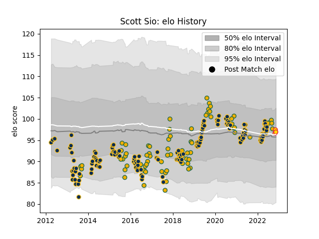

---  
layout: page  
title: Scott Sio  
date: 2022-11-15 23:36:33.825271  
categories: player  
---
# Scott Sio

## Positions: P

## Country: Australia

## Current elo: 97.0

## Current Percentile: 56.0

# Elo History

# Match History

| Team          |   Appearances |   Win Rate |
|:--------------|--------------:|-----------:|
| Brumbies      |           142 |   0.591549 |
| Australia     |            74 |   0.472973 |
| Exeter Chiefs |             3 |   0.333333 |

| Opponent                 |   Matches |   Win Rate |
|:-------------------------|----------:|-----------:|
| New Zealand              |        21 |   0.166667 |
| Queensland Reds          |        20 |   0.575    |
| Melbourne Rebels         |        17 |   0.647059 |
| New South Wales Waratahs |        14 |   0.642857 |
| Western Force            |        13 |   0.923077 |
| Argentina                |        12 |   0.791667 |
| Hurricanes               |        11 |   0.636364 |
| South Africa             |        10 |   0.5      |
| England                  |         9 |   0.222222 |
| Chiefs                   |         9 |   0.555556 |
| Highlanders              |         8 |   0.25     |
| Blues                    |         8 |   0.25     |
| Bulls                    |         7 |   0.857143 |
| Crusaders                |         7 |   0        |
| Wales                    |         5 |   0.6      |
| Sunwolves                |         5 |   1        |
| Sharks                   |         5 |   0.8      |
| Stormers                 |         4 |   0.5      |
| Ireland                  |         4 |   0.25     |
| Scotland                 |         4 |   0.5      |
| Cheetahs                 |         4 |   0.75     |
| Lions                    |         3 |   0.666667 |
| Jaguares                 |         3 |   0        |
| Fiji                     |         2 |   1        |
| Italy                    |         2 |   1        |
| Fijian Drua              |         2 |   1        |
| London Irish             |         1 |   1        |
| Northampton Saints       |         1 |   0        |
| Japan                    |         1 |   1        |
| Samoa                    |         1 |   1        |
| Gloucester Rugby         |         1 |   0        |
| Southern Kings           |         1 |   0.5      |
| Georgia                  |         1 |   1        |
| France                   |         1 |   1        |
| Uruguay                  |         1 |   1        |
| Moana Pasifika           |         1 |   0        |