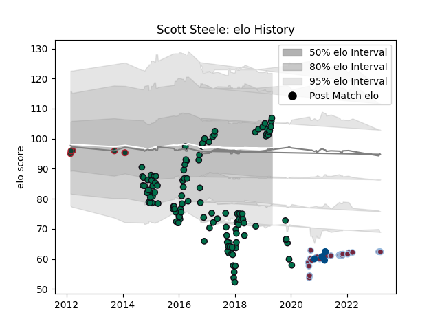

---  
layout: page  
title: Scott Steele  
date: 2023-03-21 18:06:57.995092  
categories: player  
---
# Scott Steele

Last updated: 2023-03-21
## Positions: SH

## Country: Scotland

## Current elo: 107.0

## Current Percentile: 4.0

# Elo History

# Match History

| Team             |   Appearances |   Win Rate |
|:-----------------|--------------:|-----------:|
| London Irish     |           118 |   0.457627 |
| Harlequins       |            25 |   0.62     |
| Leicester Tigers |             7 |   0.714286 |
| Scotland         |             6 |   0.666667 |

| Opponent               |   Matches |   Win Rate |
|:-----------------------|----------:|-----------:|
| Saracens               |        10 |   0.1      |
| Bath Rugby             |         9 |   0.222222 |
| Sale Sharks            |         9 |   0.111111 |
| Exeter Chiefs          |         8 |   0.375    |
| Newcastle Falcons      |         8 |   0.625    |
| Wasps                  |         8 |   0.375    |
| Northampton Saints     |         8 |   0.5      |
| Gloucester Rugby       |         8 |   0.375    |
| Worcester Warriors     |         7 |   0.571429 |
| Harlequins             |         7 |   0.285714 |
| Leicester Tigers       |         6 |   0.166667 |
| Jersey                 |         4 |   0.5      |
| Yorkshire Carnegie     |         4 |   0.75     |
| Edinburgh              |         4 |   0        |
| Ealing Trailfinders    |         3 |   1        |
| Grenoble               |         3 |   0.333333 |
| Cornish Pirates        |         3 |   1        |
| Cardiff Blues          |         3 |   0.666667 |
| Bristol Rugby          |         3 |   0.666667 |
| Bedford                |         3 |   1        |
| London Welsh           |         3 |   1        |
| London Scottish        |         2 |   1        |
| Stade Francais Paris   |         2 |   0.5      |
| Rotherham Titans       |         2 |   1        |
| Nottingham             |         2 |   1        |
| Wales                  |         2 |   0.5      |
| Krasny Yar             |         2 |   1        |
| London Irish           |         2 |   0.75     |
| Coventry               |         2 |   1        |
| Hartpury College       |         2 |   1        |
| Doncaster              |         2 |   1        |
| Krasny Yar Krasnoyarsk |         2 |   1        |
| Scarlets               |         1 |   0        |
| Bayonne                |         1 |   0        |
| Castres Olympique      |         1 |   1        |
| Ulster                 |         1 |   0        |
| Toulon                 |         1 |   0        |
| England                |         1 |   1        |
| France                 |         1 |   1        |
| Rugby Rovigo           |         1 |   1        |
| Rovigo                 |         1 |   1        |
| Richmond               |         1 |   1        |
| Ireland                |         1 |   0        |
| Italy                  |         1 |   1        |
| Agen                   |         1 |   1        |