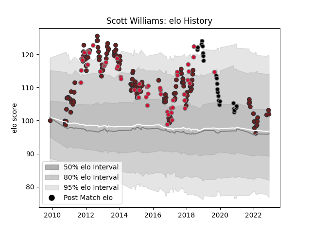

---  
layout: page  
title: Scott Williams  
date: 2023-01-06 00:22:06.305017  
categories: player  
---
# Scott Williams

## Positions: C

## Country: Wales

## Current elo: 103.0

## Current Percentile: 71.0

# Elo History

# Match History

| Team     |   Appearances |   Win Rate |
|:---------|--------------:|-----------:|
| Scarlets |           148 |   0.574324 |
| Wales    |            62 |   0.596774 |
| Ospreys  |            25 |   0.4      |

| Opponent             |   Matches |   Win Rate |
|:---------------------|----------:|-----------:|
| Ospreys              |        14 |  0.464286  |
| Cardiff Blues        |        14 |  0.857143  |
| Dragons              |        13 |  0.692308  |
| Benetton Treviso     |        13 |  0.923077  |
| Leinster             |        12 |  0.291667  |
| Munster              |        11 |  0.0909091 |
| Ulster               |        10 |  0.25      |
| Ireland              |        10 |  0.5       |
| Glasgow Warriors     |        10 |  0.9       |
| Edinburgh            |         8 |  0.5625    |
| Zebre                |         8 |  0.8125    |
| Connacht             |         7 |  0.571429  |
| England              |         6 |  0.5       |
| Australia            |         6 |  0         |
| Toulon               |         6 |  0.333333  |
| France               |         6 |  0.666667  |
| Italy                |         6 |  1         |
| Argentina            |         5 |  0.8       |
| South Africa         |         5 |  0.6       |
| New Zealand          |         5 |  0         |
| Scotland             |         5 |  0.8       |
| Leicester Tigers     |         4 |  0.25      |
| Cheetahs             |         4 |  0.75      |
| Racing 92            |         3 |  0.5       |
| Clermont Auvergne    |         3 |  0         |
| Scarlets             |         3 |  0.333333  |
| Castres Olympique    |         3 |  1         |
| Harlequins           |         3 |  0.5       |
| Southern Kings       |         2 |  0.5       |
| Samoa                |         2 |  1         |
| Bath Rugby           |         2 |  0.5       |
| Northampton Saints   |         2 |  0.5       |
| Lions                |         2 |  0.5       |
| Exeter Chiefs        |         2 |  0         |
| Fiji                 |         2 |  1         |
| Namibia              |         1 |  1         |
| Georgia              |         1 |  1         |
| Yorkshire Carnegie   |         1 |  1         |
| Worcester Warriors   |         1 |  0         |
| Uruguay              |         1 |  1         |
| Tonga                |         1 |  1         |
| Stormers             |         1 |  0         |
| Stade Francais Paris |         1 |  1         |
| Bulls                |         1 |  0         |
| Bordeaux Begles      |         1 |  0         |
| Sharks               |         1 |  0         |
| Bristol Rugby        |         1 |  0         |
| La Rochelle          |         1 |  1         |
| Saracens             |         1 |  0.5       |
| Sale Sharks          |         1 |  1         |
| London Irish         |         1 |  1         |
| Perpignan            |         1 |  1         |
| Aironi               |         1 |  1         |