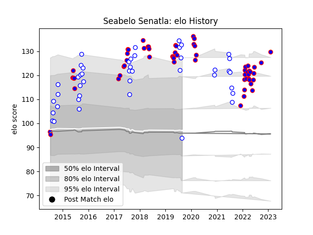

---  
layout: page  
title: Seabelo Senatla  
date: 2023-02-04 18:28:15.414515  
categories: player  
---
# Seabelo Senatla

## Positions: W

## Current elo: 94.0

## Current Percentile: 97.0

# Elo History

# Match History

| Team             |   Appearances |   Win Rate |
|:-----------------|--------------:|-----------:|
| Stormers         |            57 |   0.684211 |
| Western Province |            42 |   0.583333 |

| Opponent               |   Matches |   Win Rate |
|:-----------------------|----------:|-----------:|
| Blue Bulls             |        11 |   0.727273 |
| Sharks                 |        10 |   0.4      |
| Golden Lions           |        10 |   0.5      |
| Bulls                  |         9 |   1        |
| Free State Cheetahs    |         5 |   0.4      |
| Pumas                  |         5 |   0.7      |
| Natal Sharks           |         5 |   0.6      |
| Lions                  |         5 |   0.5      |
| Griquas                |         5 |   0.4      |
| Jaguares               |         4 |   0.75     |
| Sunwolves              |         3 |   0.666667 |
| Melbourne Rebels       |         3 |   1        |
| Chiefs                 |         2 |   0        |
| Crusaders              |         2 |   0.25     |
| Ulster                 |         2 |   1        |
| Connacht               |         2 |   0.5      |
| Blues                  |         2 |   0.5      |
| Brumbies               |         2 |   0        |
| Cheetahs               |         2 |   1        |
| Ospreys                |         1 |   1        |
| Scarlets               |         1 |   1        |
| Cardiff Blues          |         1 |   1        |
| Eastern Province Kings |         1 |   1        |
| Edinburgh              |         1 |   1        |
| Leinster               |         1 |   1        |
| Hurricanes             |         1 |   1        |
| Highlanders            |         1 |   1        |
| Glasgow Warriors       |         1 |   1        |
| Zebre                  |         1 |   1        |