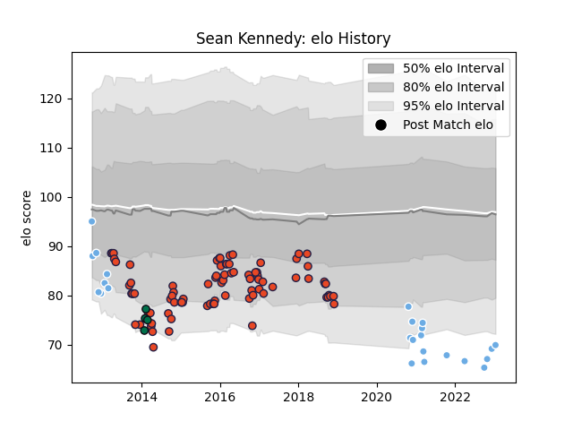

---  
layout: page  
title: Sean Kennedy  
date: 2022-12-18 16:26:43.897864  
categories: player  
---
# Sean Kennedy

## Positions: SH

## Current elo: 88.0

## Current Percentile: None

# Elo History

# Match History

| Team             |   Appearances |   Win Rate |
|:-----------------|--------------:|-----------:|
| Edinburgh        |            86 |   0.517442 |
| Glasgow Warriors |            23 |   0.565217 |
| London Irish     |             4 |   0.5      |

| Opponent             |   Matches |   Win Rate |
|:---------------------|----------:|-----------:|
| Zebre                |        12 |   0.75     |
| Ulster               |        11 |   0.272727 |
| Dragons              |        11 |   0.636364 |
| Connacht             |         9 |   0.444444 |
| Munster              |         9 |   0.222222 |
| Ospreys              |         8 |   0.375    |
| Benetton Treviso     |         7 |   0.714286 |
| Leinster             |         6 |   0.166667 |
| Cardiff Blues        |         6 |   0.166667 |
| Scarlets             |         5 |   0.5      |
| Glasgow Warriors     |         5 |   0.8      |
| Stade Francais Paris |         2 |   0.5      |
| Lyon                 |         2 |   0.5      |
| London Irish         |         2 |   1        |
| Agen                 |         2 |   1        |
| Harlequins           |         2 |   1        |
| Bordeaux Begles      |         2 |   1        |
| Bath Rugby           |         1 |   1        |
| Krasny Yar           |         1 |   1        |
| Montpellier Herault  |         1 |   0        |
| Grenoble             |         1 |   1        |
| Northampton Saints   |         1 |   1        |
| Gloucester Rugby     |         1 |   1        |
| Saracens             |         1 |   1        |
| Cheetahs             |         1 |   1        |
| Southern Kings       |         1 |   1        |
| Castres Olympique    |         1 |   0        |
| Wasps                |         1 |   0        |
| Leicester Tigers     |         1 |   0        |