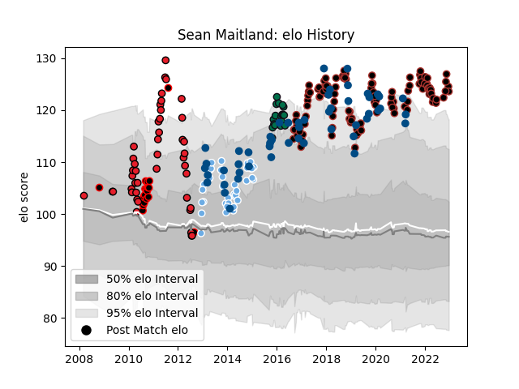

---  
layout: page  
title: Sean Maitland  
date: 2022-11-16 11:24:23.915783  
categories: player  
---
# Sean Maitland

## Positions: W, FB

## Country: Scotland

## Current elo: 125.0

## Current Percentile: 97.0

# Elo History

# Match History

| Team             |   Appearances |   Win Rate |
|:-----------------|--------------:|-----------:|
| Saracens         |           112 |   0.8125   |
| Scotland         |            51 |   0.558824 |
| Crusaders        |            44 |   0.670455 |
| Glasgow Warriors |            39 |   0.589744 |
| Canterbury       |            18 |   0.75     |
| London Irish     |            18 |   0.222222 |

| Opponent                 |   Matches |   Win Rate |
|:-------------------------|----------:|-----------:|
| Harlequins               |        12 |   0.666667 |
| Bath Rugby               |        11 |   0.681818 |
| Northampton Saints       |        11 |   1        |
| Sale Sharks              |         9 |   0.666667 |
| Exeter Chiefs            |         9 |   0.722222 |
| Wasps                    |         8 |   0.625    |
| Newcastle Falcons        |         8 |   0.875    |
| Gloucester Rugby         |         8 |   0.625    |
| Ireland                  |         8 |   0.25     |
| Leicester Tigers         |         8 |   0.75     |
| France                   |         7 |   0.428571 |
| Worcester Warriors       |         7 |   0.857143 |
| Edinburgh                |         7 |   0.857143 |
| England                  |         6 |   0.416667 |
| London Irish             |         6 |   0.75     |
| Munster                  |         6 |   0.833333 |
| Leinster                 |         5 |   0.4      |
| Chiefs                   |         5 |   0.6      |
| Bristol Rugby            |         5 |   0.6      |
| Stormers                 |         5 |   0.8      |
| Bulls                    |         5 |   0.4      |
| Italy                    |         4 |   1        |
| Highlanders              |         4 |   0.5      |
| Scarlets                 |         4 |   0.75     |
| Ospreys                  |         4 |   0.875    |
| Japan                    |         4 |   1        |
| Cardiff Blues            |         4 |   0.5      |
| Toulon                   |         4 |   0.5      |
| Argentina                |         4 |   1        |
| Australia                |         4 |   0.25     |
| Blues                    |         4 |   0.75     |
| Queensland Reds          |         4 |   0.5      |
| Ulster                   |         3 |   0.333333 |
| Glasgow Warriors         |         3 |   1        |
| Racing 92                |         3 |   0.333333 |
| Western Force            |         3 |   0.666667 |
| Wellington               |         3 |   1        |
| Sharks                   |         3 |   1        |
| South Africa             |         3 |   0        |
| Tasman                   |         3 |   0.333333 |
| Georgia                  |         2 |   1        |
| Castres Olympique        |         2 |   0        |
| Waikato                  |         2 |   0.5      |
| Samoa                    |         2 |   1        |
| Stade Toulousain         |         2 |   0        |
| Saracens                 |         2 |   0        |
| Wales                    |         2 |   0        |
| Benetton Treviso         |         2 |   1        |
| New South Wales Waratahs |         2 |   1        |
| Lyon                     |         2 |   1        |
| Montpellier Herault      |         2 |   1        |
| Hurricanes               |         2 |   0.25     |
| Clermont Auvergne        |         2 |   0        |
| United States of America |         2 |   1        |
| Brumbies                 |         2 |   1        |
| Lions                    |         2 |   1        |
| Cheetahs                 |         2 |   1        |
| Taranaki                 |         1 |   0        |
| Southland                |         1 |   1        |
| Agen                     |         1 |   1        |
| Otago                    |         1 |   1        |
| Doncaster                |         1 |   1        |
| Auckland                 |         1 |   1        |
| Bay of Plenty            |         1 |   1        |
| Bedford                  |         1 |   1        |
| Canada                   |         1 |   1        |
| Connacht                 |         1 |   1        |
| Cornish Pirates          |         1 |   0        |
| Counties Manukau         |         1 |   1        |
| Coventry                 |         1 |   1        |
| Ealing Trailfinders      |         1 |   1        |
| Northland                |         1 |   1        |
| Fiji                     |         1 |   1        |
| Grenoble                 |         1 |   0        |
| Hawke's Bay              |         1 |   0.5      |
| Ampthill                 |         1 |   1        |
| Manawatu                 |         1 |   1        |
| Melbourne Rebels         |         1 |   0        |
| New Zealand              |         1 |   0        |
| North Harbour            |         1 |   1        |
| Zebre                    |         1 |   1        |