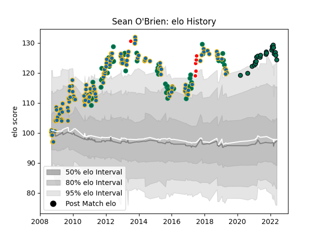

---  
layout: page  
title: Sean O'Brien  
date: 2022-11-15 23:38:31.655430  
categories: player  
---
# Sean O'Brien

## Positions: FL, N8

## Country: Ireland

## Current elo: 122.0

## Current Percentile: 95.0

# Elo History

# Match History

| Team                    |   Appearances |   Win Rate |
|:------------------------|--------------:|-----------:|
| Leinster                |           131 |   0.759542 |
| Ireland                 |            51 |   0.54902  |
| London Irish            |            23 |   0.478261 |
| British and Irish Lions |             6 |   0.75     |

| Opponent             |   Matches |   Win Rate |
|:---------------------|----------:|-----------:|
| Ulster               |        16 |   0.8125   |
| Munster              |        13 |   0.615385 |
| Glasgow Warriors     |        10 |   0.6      |
| Scarlets             |         8 |   0.75     |
| Italy                |         8 |   0.875    |
| France               |         8 |   0.5      |
| Edinburgh            |         8 |   0.875    |
| New Zealand          |         8 |   0.1875   |
| Wasps                |         8 |   0.6875   |
| Cardiff Blues        |         7 |   0.928571 |
| Connacht             |         7 |   0.857143 |
| Wales                |         7 |   0.142857 |
| England              |         7 |   0.428571 |
| Bath Rugby           |         7 |   0.714286 |
| Scotland             |         6 |   0.666667 |
| Ospreys              |         6 |   1        |
| Northampton Saints   |         6 |   0.666667 |
| Clermont Auvergne    |         5 |   0.4      |
| Exeter Chiefs        |         5 |   0.8      |
| Saracens             |         4 |   0.75     |
| Benetton Treviso     |         4 |   0.5      |
| Leicester Tigers     |         4 |   0.5      |
| Stade Toulousain     |         3 |   0.666667 |
| Montpellier Herault  |         3 |   0.5      |
| Zebre                |         3 |   1        |
| Dragons              |         3 |   0.666667 |
| Australia            |         3 |   0.666667 |
| Castres Olympique    |         3 |   0.666667 |
| Sale Sharks          |         2 |   0.25     |
| Worcester Warriors   |         2 |   0.5      |
| Bristol Rugby        |         2 |   0.75     |
| Brive                |         2 |   1        |
| Canada               |         2 |   1        |
| London Irish         |         2 |   0.25     |
| Argentina            |         2 |   1        |
| Racing 92            |         2 |   1        |
| Gloucester Rugby     |         2 |   0.5      |
| Harlequins           |         2 |   0.75     |
| Newcastle Falcons    |         2 |   1        |
| Samoa                |         1 |   1        |
| Russia               |         1 |   1        |
| Crusaders            |         1 |   1        |
| Romania              |         1 |   1        |
| South Africa         |         1 |   1        |
| Stade Francais Paris |         1 |   1        |
| Toulon               |         1 |   0        |
| New Zealand Maori    |         1 |   1        |
| Aironi               |         1 |   1        |