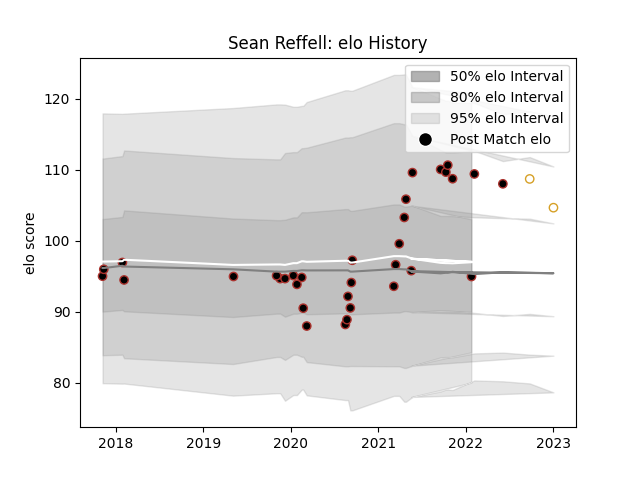

---  
layout: page  
title: Sean Reffell  
date: 2023-01-03 11:27:47.032191  
categories: player  
---
# Sean Reffell

## Positions: FL

## Current elo: 95.0

## Current Percentile: 85.0

# Elo History

# Match History

| Team     |   Appearances |   Win Rate |
|:---------|--------------:|-----------:|
| Saracens |            33 |   0.621212 |
| Ulster   |             2 |   0.5      |

| Opponent            |   Matches |   Win Rate |
|:--------------------|----------:|-----------:|
| Sale Sharks         |         3 |   0.333333 |
| Exeter Chiefs       |         3 |   0.666667 |
| Harlequins          |         3 |   0.333333 |
| London Irish        |         3 |   0.833333 |
| Wasps               |         2 |   0        |
| Munster             |         2 |   0        |
| Bristol Rugby       |         2 |   0.5      |
| Gloucester Rugby    |         2 |   0.5      |
| Bath Rugby          |         2 |   1        |
| Scarlets            |         1 |   1        |
| Richmond            |         1 |   1        |
| Racing 92           |         1 |   0        |
| Ospreys             |         1 |   1        |
| Newcastle Falcons   |         1 |   1        |
| Ampthill            |         1 |   1        |
| Leicester Tigers    |         1 |   1        |
| Ealing Trailfinders |         1 |   1        |
| Dragons             |         1 |   1        |
| Doncaster           |         1 |   1        |
| Coventry            |         1 |   1        |
| Cornish Pirates     |         1 |   0        |
| Jersey              |         1 |   1        |