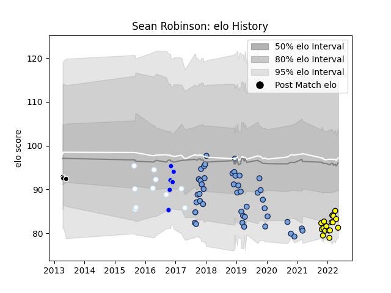

---  
layout: page  
title: Sean Robinson  
date: 2022-12-18 16:23:13.998970  
categories: player  
---
# Sean Robinson

## Positions: C, W

## Current elo: 82.0

## Current Percentile: None

# Elo History

# Match History

| Team      |   Appearances |   Win Rate |
|:----------|--------------:|-----------:|
| Bayonne   |            44 |   0.443182 |
| Albi      |            17 |   0.647059 |
| Racing 92 |            10 |   0.4      |
| Colomiers |             6 |   0.833333 |
| Sharks    |             3 |   0        |

| Opponent                   |   Matches |   Win Rate |
|:---------------------------|----------:|-----------:|
| Soyaux-Angouleme           |         4 |   0.25     |
| Toulon                     |         4 |   0.5      |
| Dax                        |         4 |   0.875    |
| Aurillac                   |         3 |   0.666667 |
| Beziers                    |         3 |   0.666667 |
| Brive                      |         3 |   0        |
| Grenoble                   |         3 |   0.333333 |
| Perpignan                  |         3 |   0.333333 |
| Mont-de-Marsan             |         3 |   0.333333 |
| Colomiers                  |         3 |   0.666667 |
| Agen                       |         3 |   0.666667 |
| Valence Romans Drome Rugby |         2 |   0.5      |
| Tarbes                     |         2 |   0.5      |
| Suresnes                   |         2 |   1        |
| Scarlets                   |         2 |   0        |
| Montauban                  |         2 |   0.5      |
| Massy                      |         2 |   0.5      |
| La Rochelle                |         2 |   0.5      |
| Lyon                       |         2 |   0        |
| Vannes                     |         2 |   1        |
| Aubenas                    |         2 |   1        |
| Biarritz Olympique         |         2 |   0        |
| Chambery                   |         2 |   1        |
| Carcassonne                |         2 |   0.5      |
| Provence Rugby             |         1 |   0        |
| Blagnac                    |         1 |   1        |
| Bordeaux Begles            |         1 |   1        |
| Stormers                   |         1 |   0        |
| Stade Toulousain           |         1 |   0        |
| Bulls                      |         1 |   0        |
| Racing 92                  |         1 |   0        |
| Cognac Saint Jean d'Angély |         1 |   1        |
| London Irish               |         1 |   1        |
| Oyonnax                    |         1 |   1        |
| Nice                       |         1 |   0        |
| Nevers                     |         1 |   1        |
| Narbonne                   |         1 |   1        |
| Montpellier Herault        |         1 |   0        |
| Cheetahs                   |         1 |   0        |
| Clermont Auvergne          |         1 |   0        |
| Albi                       |         1 |   0        |
| Castres Olympique          |         1 |   1        |