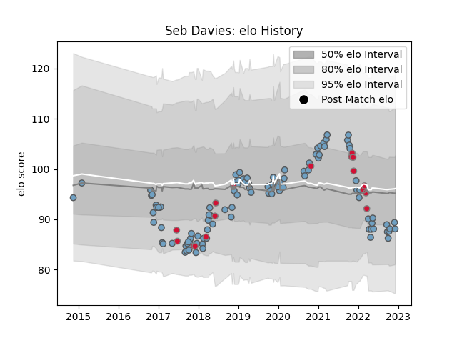

---  
layout: page  
title: Seb Davies  
date: 2022-12-14 11:36:36.743964  
categories: player  
---
# Seb Davies

## Positions: L

## Country: Wales

## Current elo: 90.0

## Current Percentile: 22.0

# Elo History

# Match History

| Team          |   Appearances |   Win Rate |
|:--------------|--------------:|-----------:|
| Cardiff Blues |           104 |   0.490385 |
| Wales         |            17 |   0.647059 |

| Opponent           |   Matches |   Win Rate |
|:-------------------|----------:|-----------:|
| Scarlets           |        12 |   0.5      |
| Dragons            |         8 |   1        |
| Connacht           |         7 |   0.428571 |
| Ospreys            |         7 |   0.142857 |
| Munster            |         7 |   0.285714 |
| Edinburgh          |         6 |   0.333333 |
| Benetton Treviso   |         5 |   0.8      |
| Glasgow Warriors   |         5 |   0        |
| Cheetahs           |         4 |   0.5      |
| Southern Kings     |         3 |   1        |
| South Africa       |         3 |   0.666667 |
| Sale Sharks        |         3 |   0.333333 |
| Pau                |         3 |   1        |
| Ulster             |         3 |   0.333333 |
| Zebre              |         3 |   1        |
| Stade Toulousain   |         2 |   0.5      |
| Tonga              |         2 |   1        |
| Leicester Tigers   |         2 |   0        |
| Sharks             |         2 |   1        |
| Saracens           |         2 |   0        |
| Leinster           |         2 |   0        |
| Italy              |         2 |   0.5      |
| Bath Rugby         |         2 |   0.5      |
| Harlequins         |         2 |   0        |
| Bulls              |         2 |   0        |
| Calvisano          |         2 |   1        |
| France             |         2 |   0        |
| Exeter Chiefs      |         1 |   0        |
| Worcester Warriors |         1 |   0        |
| Wasps              |         1 |   1        |
| Bristol Rugby      |         1 |   1        |
| Brive              |         1 |   1        |
| England            |         1 |   0        |
| Scotland           |         1 |   1        |
| Fiji               |         1 |   1        |
| Australia          |         1 |   1        |
| Samoa              |         1 |   1        |
| Georgia            |         1 |   1        |
| Gloucester Rugby   |         1 |   1        |
| Newcastle Falcons  |         1 |   1        |
| New Zealand        |         1 |   0        |
| Lyon               |         1 |   1        |
| London Irish       |         1 |   0        |
| Lions              |         1 |   0        |
| Argentina          |         1 |   1        |