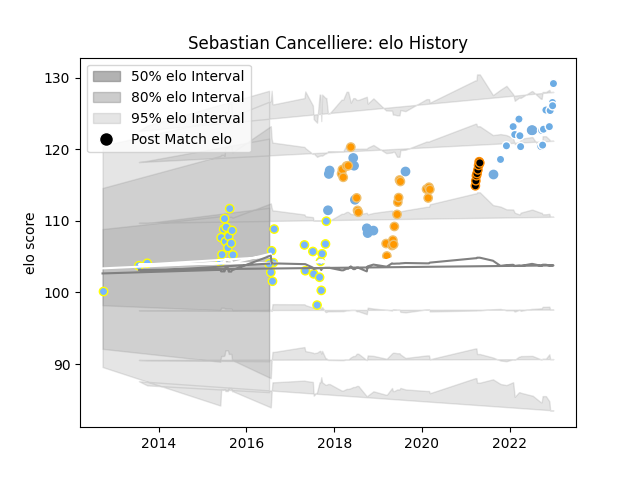

---  
layout: page  
title: Sebastian Cancelliere  
date: 2023-02-02 18:57:12.415140  
categories: player  
---
# Sebastian Cancelliere

## Positions: W, SH

## Country: Argentina

## Current elo: 96.0

## Current Percentile: 35.0

# Elo History

# Match History

| Team             |   Appearances |   Win Rate |
|:-----------------|--------------:|-----------:|
| Hindu            |            33 |   0.787879 |
| Jaguares         |            24 |   0.5      |
| Glasgow Warriors |            20 |   0.775    |
| Argentina        |            13 |   0.230769 |
| Jaguares XV      |             8 |   1        |

| Opponent                 |   Matches |   Win Rate |
|:-------------------------|----------:|-----------:|
| CUBA                     |         4 |   0.75     |
| Stormers                 |         4 |   0.5      |
| Regatas Bella Vista      |         4 |   1        |
| Bulls                    |         4 |   0.75     |
| CASI                     |         3 |   0.666667 |
| Edinburgh                |         3 |   1        |
| Atlético del Rosario     |         3 |   0.666667 |
| Newman                   |         3 |   0        |
| Hurricanes               |         3 |   0.333333 |
| Zebre                    |         3 |   1        |
| Sharks                   |         3 |   0.333333 |
| La Plata                 |         3 |   0.666667 |
| Scotland                 |         2 |   0        |
| San Luis                 |         2 |   1        |
| SIC                      |         2 |   1        |
| Selknam                  |         2 |   1        |
| Pucara                   |         2 |   1        |
| Olimpia Lions            |         2 |   1        |
| South Africa             |         2 |   0        |
| Wales                    |         2 |   0        |
| Alumni                   |         2 |   1        |
| Lions                    |         2 |   0        |
| Cardiff Blues            |         2 |   0.5      |
| Belgrano                 |         2 |   1        |
| Dragons                  |         2 |   1        |
| Benetton Treviso         |         2 |   0.5      |
| Brumbies                 |         2 |   1        |
| Cafeteros Pro            |         2 |   1        |
| Cobras                   |         1 |   1        |
| Pueyrredón               |         1 |   1        |
| Queensland Reds          |         1 |   0        |
| Chiefs                   |         1 |   1        |
| Blues                    |         1 |   1        |
| Perpignan                |         1 |   1        |
| Bath Rugby               |         1 |   0.5      |
| Sunwolves                |         1 |   1        |
| Australia                |         1 |   0        |
| Portugal                 |         1 |   1        |
| Highlanders              |         1 |   0        |
| Georgia                  |         1 |   1        |
| Ospreys                  |         1 |   0        |
| Connacht                 |         1 |   1        |
| Crusaders                |         1 |   0        |
| New Zealand              |         1 |   0        |
| New South Wales Waratahs |         1 |   1        |
| Munster                  |         1 |   1        |
| Melbourne Rebels         |         1 |   1        |
| Los Tilos                |         1 |   1        |
| Lomas                    |         1 |   1        |
| Leinster                 |         1 |   0        |
| England                  |         1 |   0        |
| Italy                    |         1 |   1        |
| Ireland                  |         1 |   0        |
| Penarol Rugby            |         1 |   1        |