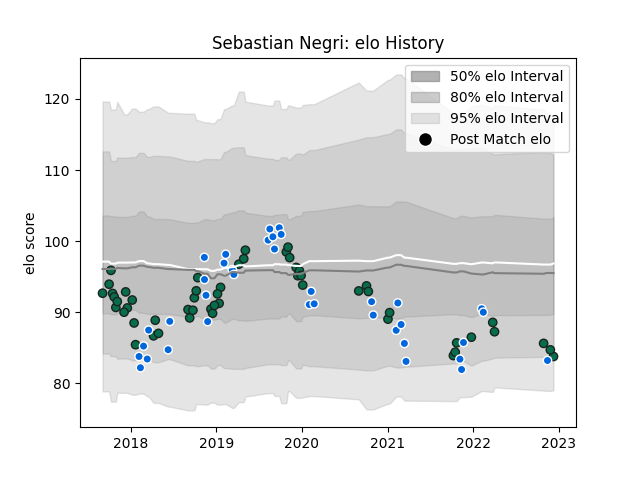

---  
layout: page  
title: Sebastian Negri  
date: 2022-12-14 11:23:22.731223  
categories: player  
---
# Sebastian Negri

## Positions: FL

## Country: Italy

## Current elo: 84.0

## Current Percentile: 10.0

# Elo History

# Match History

| Team             |   Appearances |   Win Rate |
|:-----------------|--------------:|-----------:|
| Benetton Treviso |            53 |   0.424528 |
| Italy            |            37 |   0.189189 |

| Opponent             |   Matches |   Win Rate |
|:---------------------|----------:|-----------:|
| Zebre                |         9 |   0.666667 |
| France               |         6 |   0        |
| England              |         6 |   0        |
| Scarlets             |         5 |   0        |
| Glasgow Warriors     |         4 |   0.25     |
| Edinburgh            |         4 |   0.5      |
| Leinster             |         4 |   0.375    |
| Ireland              |         4 |   0        |
| Scotland             |         4 |   0        |
| Wales                |         4 |   0        |
| Southern Kings       |         3 |   1        |
| Munster              |         3 |   0        |
| Toulon               |         2 |   0        |
| Ulster               |         2 |   0        |
| New Zealand          |         2 |   0        |
| Lyon                 |         2 |   0.5      |
| Ospreys              |         2 |   0        |
| Japan                |         2 |   0.5      |
| Harlequins           |         2 |   0.5      |
| Grenoble             |         2 |   1        |
| Georgia              |         2 |   1        |
| Dragons              |         2 |   1        |
| Bath Rugby           |         2 |   0        |
| Australia            |         2 |   0.5      |
| Argentina            |         1 |   0        |
| Russia               |         1 |   1        |
| Connacht             |         1 |   0        |
| Cheetahs             |         1 |   1        |
| South Africa         |         1 |   0        |
| Cardiff Blues        |         1 |   1        |
| Stade Francais Paris |         1 |   0        |
| Canada               |         1 |   1        |
| Uruguay              |         1 |   1        |
| Agen                 |         1 |   1        |