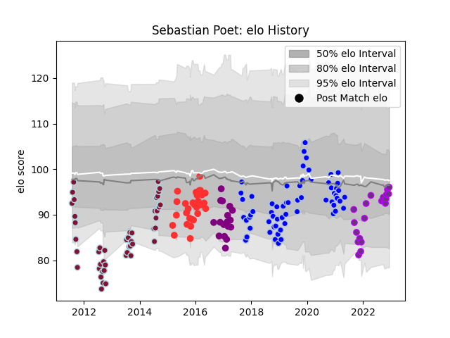

---  
layout: page  
title: Sebastian Poet  
date: 2022-12-09 13:04:46.215634  
categories: player  
---
# Sebastian Poet

## Positions: FH

## Current elo: 95.0

## Current Percentile: 45.0

# Elo History

# Match History

| Team                 |   Appearances |   Win Rate |
|:---------------------|--------------:|-----------:|
| Colomiers            |            62 |   0.548387 |
| Atlético del Rosario |            46 |   0.423913 |
| Tarbes               |            29 |   0.465517 |
| US Bressane          |            21 |   0.428571 |
| Soyaux-Angouleme     |            17 |   0.411765 |

| Opponent                   |   Matches |   Win Rate |
|:---------------------------|----------:|-----------:|
| Aurillac                   |        10 |  0.4       |
| Beziers                    |         9 |  0.666667  |
| Biarritz Olympique         |         9 |  0.444444  |
| Montauban                  |         9 |  0.444444  |
| Mont-de-Marsan             |         8 |  0.5       |
| Carcassonne                |         8 |  0.625     |
| Oyonnax                    |         6 |  0.0833333 |
| Perpignan                  |         5 |  0.6       |
| Nevers                     |         5 |  0.2       |
| Narbonne                   |         5 |  0.5       |
| Albi                       |         5 |  0.2       |
| Dax                        |         5 |  0.6       |
| Vannes                     |         5 |  0.4       |
| Bourgoin-Jallieu           |         4 |  0.75      |
| Colomiers                  |         4 |  0.25      |
| CASI                       |         4 |  0.25      |
| Hindu                      |         4 |  0         |
| La Plata                   |         4 |  0.25      |
| Provence Rugby             |         4 |  0.75      |
| Alumni                     |         4 |  0.375     |
| Belgrano                   |         4 |  0.375     |
| Massy                      |         4 |  0.25      |
| San Luis                   |         4 |  0.25      |
| Rouen                      |         3 |  0.833333  |
| Pucara                     |         3 |  0.333333  |
| Bayonne                    |         3 |  0.333333  |
| CUBA                       |         3 |  0         |
| Soyaux-Angouleme           |         3 |  0.333333  |
| Lomas                      |         3 |  1         |
| Grenoble                   |         3 |  0.666667  |
| Newman                     |         2 |  0.5       |
| US Bressane                |         2 |  0.5       |
| Valence Romans Drome Rugby |         2 |  0.5       |
| SIC                        |         2 |  0         |
| Regatas Bella Vista        |         2 |  1         |
| Suresnes                   |         1 |  1         |
| San Cirano                 |         1 |  1         |
| San Albano                 |         1 |  0.5       |
| Roval Drome XV             |         1 |  1         |
| Olivos                     |         1 |  1         |
| Rennes                     |         1 |  1         |
| Pueyrredón                 |         1 |  1         |
| Carqueiranne-Hyères        |         1 |  1         |
| Nice                       |         1 |  1         |
| Blagnac                    |         1 |  1         |
| Brive                      |         1 |  1         |
| Manuel Belgrano            |         1 |  1         |
| Los Tilos                  |         1 |  1         |
| Liceo Naval                |         1 |  1         |
| Agen                       |         1 |  0         |