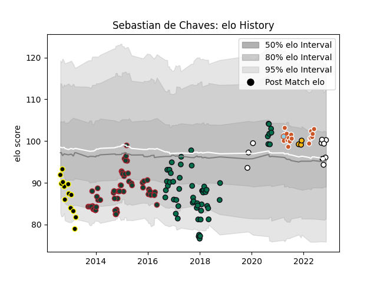

---  
layout: page  
title: Sebastian de Chaves  
date: 2022-12-09 13:09:36.716241  
categories: player  
---
# Sebastian de Chaves

## Positions: L

## Current elo: 95.0

## Current Percentile: 58.0

# Elo History

# Match History

| Team              |   Appearances |   Win Rate |
|:------------------|--------------:|-----------:|
| Leicester Tigers  |            56 |   0.598214 |
| London Irish      |            56 |   0.5      |
| Austin Gilgronis  |            17 |   0.529412 |
| Mont-de-Marsan    |            13 |   0.153846 |
| Newcastle Falcons |            13 |   0.461538 |
| Wasps             |             3 |   0        |
| Austin Herd       |             1 |   0        |

| Opponent               |   Matches |   Win Rate |
|:-----------------------|----------:|-----------:|
| Gloucester Rugby       |        12 |  0.416667  |
| Bath Rugby             |        11 |  0.136364  |
| Northampton Saints     |         9 |  0.388889  |
| London Irish           |         8 |  0.5       |
| Exeter Chiefs          |         8 |  0.5       |
| Saracens               |         7 |  0.0714286 |
| Sale Sharks            |         7 |  0.571429  |
| Newcastle Falcons      |         7 |  0.571429  |
| Harlequins             |         7 |  0.571429  |
| Worcester Warriors     |         6 |  0.333333  |
| Wasps                  |         5 |  0.4       |
| Stade Francais Paris   |         4 |  0.25      |
| Leicester Tigers       |         4 |  0         |
| Yorkshire Carnegie     |         4 |  1         |
| Bordeaux Begles        |         3 |  0.666667  |
| San Diego Legion       |         3 |  0.666667  |
| Houston SaberCats      |         3 |  1         |
| L. A. Giltinis         |         3 |  0         |
| London Scottish        |         3 |  1         |
| New England Free Jacks |         2 |  0         |
| Bristol Rugby          |         2 |  0.5       |
| Rotherham Titans       |         2 |  1         |
| Richmond               |         2 |  1         |
| Toulon                 |         2 |  0         |
| Ealing Trailfinders    |         2 |  1         |
| Cardiff Blues          |         2 |  1         |
| Clermont Auvergne      |         2 |  0         |
| Nottingham             |         2 |  1         |
| Seattle Seawolves      |         2 |  1         |
| Utah Warriors          |         2 |  0         |
| Cornish Pirates        |         2 |  1         |
| Benetton Treviso       |         2 |  1         |
| Krasny Yar             |         2 |  1         |
| Jersey                 |         2 |  0.5       |
| Doncaster              |         2 |  1         |
| Ulster                 |         2 |  0.5       |
| Biarritz Olympique     |         1 |  0         |
| Bedford                |         1 |  1         |
| Edinburgh              |         1 |  0         |
| Scarlets               |         1 |  0         |
| Ospreys                |         1 |  1         |
| Old Glory DC           |         1 |  0         |
| NOLA Gold              |         1 |  1         |
| London Welsh           |         1 |  1         |
| Coventry               |         1 |  1         |
| Dallas Jackals         |         1 |  1         |
| Agen                   |         1 |  0         |