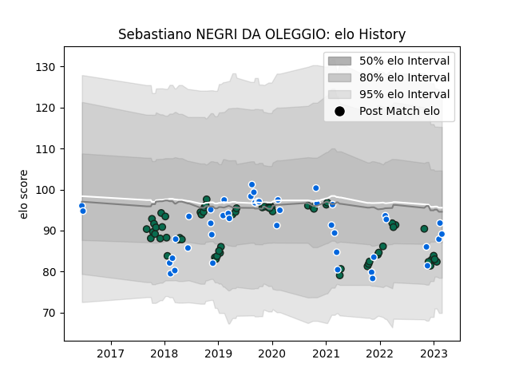

---  
layout: page  
title: Sebastiano NEGRI DA OLEGGIO  
date: 2023-03-12 11:30:55.604204  
categories: player  
---
# Sebastiano NEGRI DA OLEGGIO

## Positions: FL

## Country: Italy

## Current elo: 85.0

## Current Percentile: 36.0

# Elo History

# Match History

| Team             |   Appearances |   Win Rate |
|:-----------------|--------------:|-----------:|
| Benetton Treviso |            62 |   0.443548 |
| Italy            |            44 |   0.204545 |

| Opponent                 |   Matches |   Win Rate |
|:-------------------------|----------:|-----------:|
| Zebre                    |        10 |   0.7      |
| England                  |         7 |   0        |
| France                   |         7 |   0        |
| Scarlets                 |         5 |   0        |
| Wales                    |         5 |   0        |
| Ireland                  |         5 |   0        |
| Scotland                 |         4 |   0        |
| Leinster                 |         4 |   0.375    |
| Edinburgh                |         4 |   0.5      |
| Glasgow Warriors         |         4 |   0.25     |
| Toulon                   |         3 |   0        |
| Southern Kings           |         3 |   1        |
| Ulster                   |         3 |   0.333333 |
| Munster                  |         3 |   0        |
| Lyon                     |         3 |   0.333333 |
| Stade Francais Paris     |         2 |   0.5      |
| South Africa             |         2 |   0        |
| Ospreys                  |         2 |   0        |
| New Zealand              |         2 |   0        |
| Agen                     |         2 |   1        |
| Japan                    |         2 |   0.5      |
| Canada                   |         2 |   1        |
| Australia                |         2 |   0.5      |
| Grenoble                 |         2 |   1        |
| Georgia                  |         2 |   1        |
| Dragons                  |         2 |   1        |
| Bath Rugby               |         2 |   0        |
| Harlequins               |         2 |   0.5      |
| Uruguay                  |         1 |   1        |
| United States of America |         1 |   1        |
| Bayonne                  |         1 |   1        |
| Argentina                |         1 |   0        |
| Cardiff Blues            |         1 |   1        |
| Connacht                 |         1 |   0        |
| Russia                   |         1 |   1        |
| Gloucester Rugby         |         1 |   0        |
| Montpellier Herault      |         1 |   0        |
| Cheetahs                 |         1 |   1        |