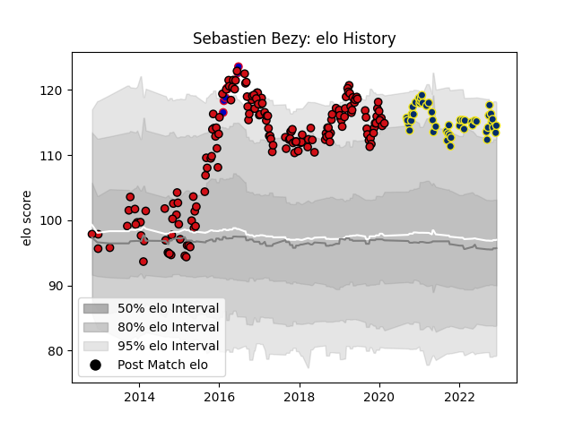

---  
layout: page  
title: Sebastien Bezy  
date: 2023-02-02 19:10:13.455420  
categories: player  
---
# Sebastien Bezy

## Positions: SH

## Country: France

## Current elo: 95.0

## Current Percentile: 96.0

# Elo History

# Match History

| Team              |   Appearances |   Win Rate |
|:------------------|--------------:|-----------:|
| Stade Toulousain  |           181 |   0.635359 |
| Clermont Auvergne |            57 |   0.45614  |
| France            |             7 |   0.428571 |

| Opponent             |   Matches |   Win Rate |
|:---------------------|----------:|-----------:|
| Racing 92            |        22 |   0.409091 |
| Montpellier Herault  |        19 |   0.578947 |
| Stade Francais Paris |        17 |   0.705882 |
| La Rochelle          |        16 |   0.5625   |
| Castres Olympique    |        16 |   0.4375   |
| Lyon                 |        14 |   0.535714 |
| Bordeaux Begles      |        12 |   0.583333 |
| Pau                  |        11 |   0.727273 |
| Toulon               |        10 |   0.45     |
| Brive                |        10 |   0.55     |
| Bayonne              |         8 |   0.5      |
| Clermont Auvergne    |         8 |   0.875    |
| Grenoble             |         8 |   0.5      |
| Perpignan            |         7 |   0.714286 |
| Oyonnax              |         7 |   0.785714 |
| Agen                 |         7 |   1        |
| Connacht             |         5 |   0.8      |
| Stade Toulousain     |         5 |   0.4      |
| Zebre                |         4 |   1        |
| Wasps                |         4 |   0.625    |
| Leinster             |         3 |   0.333333 |
| Bath Rugby           |         3 |   1        |
| Biarritz Olympique   |         3 |   1        |
| Ulster               |         2 |   0        |
| Stormers             |         2 |   0.5      |
| Saracens             |         2 |   0.5      |
| Sale Sharks          |         2 |   0.75     |
| Cardiff Blues        |         2 |   0        |
| Glasgow Warriors     |         2 |   1        |
| Gloucester Rugby     |         2 |   1        |
| Argentina            |         2 |   0.5      |
| Leicester Tigers     |         2 |   0        |
| Ireland              |         1 |   1        |
| England              |         1 |   0        |
| Scotland             |         1 |   0        |
| Ospreys              |         1 |   0        |
| Munster              |         1 |   0        |
| Mont-de-Marsan       |         1 |   1        |
| Wales                |         1 |   0        |
| Italy                |         1 |   1        |