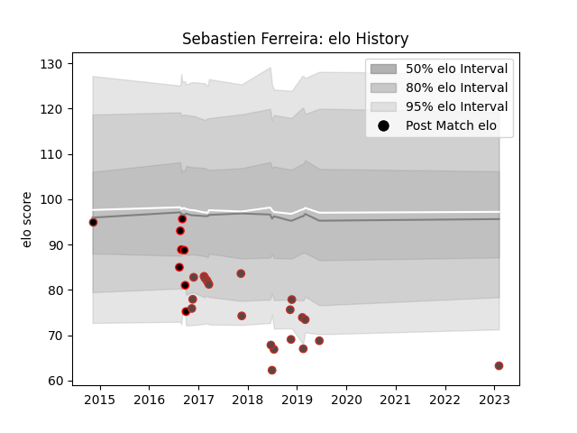

---  
layout: page  
title: Sebastien Ferreira  
date: 2023-02-05 15:08:29.360617  
categories: player  
---
# Sebastien Ferreira

## Positions: FL, L

## Country: Germany

## Current elo: 63.0

## Current Percentile: None

# Elo History

# Match History

| Team                   |   Appearances |   Win Rate |
|:-----------------------|--------------:|-----------:|
| Germany                |            21 |   0.428571 |
| Eastern Province Kings |             7 |   0        |
| Saracens               |             1 |   1        |

| Opponent                 |   Matches |   Win Rate |
|:-------------------------|----------:|-----------:|
| Brazil                   |         3 |        1   |
| Belgium                  |         2 |        0.5 |
| Portugal                 |         2 |        0.5 |
| Georgia                  |         2 |        0   |
| Samoa                    |         2 |        0   |
| Russia                   |         2 |        0   |
| Romania                  |         2 |        0.5 |
| Uruguay                  |         1 |        1   |
| United States of America |         1 |        0   |
| Spain                    |         1 |        0   |
| Pumas                    |         1 |        0   |
| Natal Sharks             |         1 |        0   |
| Ospreys                  |         1 |        1   |
| Blue Bulls               |         1 |        0   |
| Kenya                    |         1 |        1   |
| Hong Kong                |         1 |        1   |
| Golden Lions             |         1 |        0   |
| Free State Cheetahs      |         1 |        0   |
| Canada                   |         1 |        0   |
| Boland Cavaliers         |         1 |        0   |
| Western Province         |         1 |        0   |