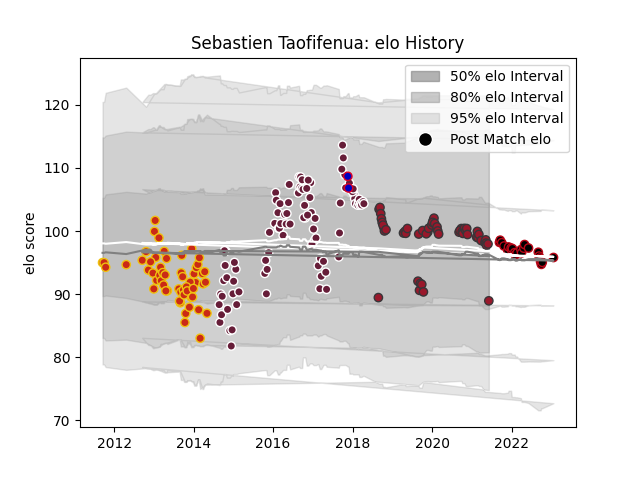

---  
layout: page  
title: Sebastien Taofifenua  
date: 2023-02-02 18:47:53.624538  
categories: player  
---
# Sebastien Taofifenua

## Positions: P

## Country: France

## Current elo: 89.0

## Current Percentile: 55.0

# Elo History

# Match History

| Team            |   Appearances |   Win Rate |
|:----------------|--------------:|-----------:|
| Bordeaux Begles |            92 |   0.478261 |
| Perpignan       |            56 |   0.473214 |
| Toulon          |            53 |   0.528302 |
| Lyon            |            25 |   0.52     |
| France          |             2 |   0.25     |

| Opponent             |   Matches |   Win Rate |
|:---------------------|----------:|-----------:|
| Montpellier Herault  |        17 |   0.441176 |
| Stade Francais Paris |        17 |   0.411765 |
| Clermont Auvergne    |        16 |   0.40625  |
| Racing 92            |        14 |   0.392857 |
| Toulon               |        14 |   0.214286 |
| La Rochelle          |        14 |   0.285714 |
| Stade Toulousain     |        14 |   0.5      |
| Castres Olympique    |        13 |   0.384615 |
| Brive                |        12 |   0.75     |
| Pau                  |        11 |   0.636364 |
| Agen                 |        10 |   0.8      |
| Grenoble             |         9 |   0.666667 |
| Bordeaux Begles      |         8 |   0.625    |
| Bayonne              |         8 |   0.375    |
| Lyon                 |         7 |   0.428571 |
| Oyonnax              |         6 |   0.5      |
| Edinburgh            |         4 |   0.25     |
| Biarritz Olympique   |         4 |   0.75     |
| Exeter Chiefs        |         4 |   0.5      |
| Newcastle Falcons    |         3 |   0        |
| Perpignan            |         3 |   1        |
| Scarlets             |         2 |   1        |
| Ulster               |         2 |   1        |
| Munster              |         2 |   0        |
| Gloucester Rugby     |         2 |   0        |
| Dragons              |         2 |   0.5      |
| Bizkaia Gernika RT   |         2 |   1        |
| Mont-de-Marsan       |         1 |   1        |
| London Welsh         |         1 |   1        |
| Leicester Tigers     |         1 |   1        |
| Japan                |         1 |   0.5      |
| Rovigo               |         1 |   1        |
| South Africa         |         1 |   0        |
| Bulls                |         1 |   1        |
| London Irish         |         1 |   1        |