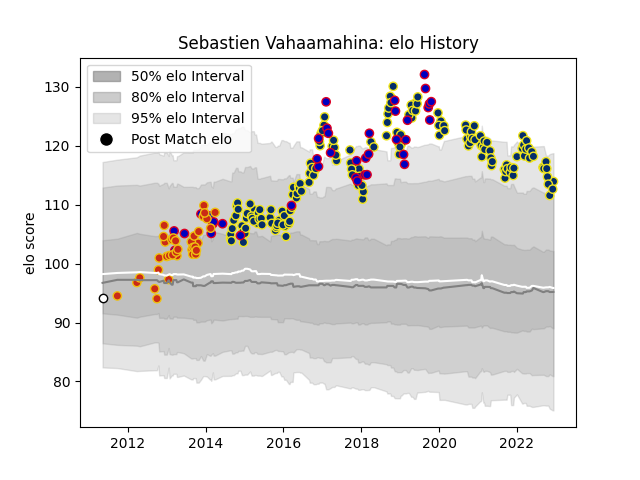

---  
layout: page  
title: Sebastien Vahaamahina  
date: 2022-12-14 11:11:39.459106  
categories: player  
---
# Sebastien Vahaamahina

## Positions: L

## Country: France

## Current elo: 114.0

## Current Percentile: 90.0

# Elo History

# Match History

| Team              |   Appearances |   Win Rate |
|:------------------|--------------:|-----------:|
| Clermont Auvergne |           165 |   0.669697 |
| France            |            39 |   0.410256 |
| Perpignan         |            36 |   0.583333 |
| Brive             |             1 |   0        |

| Opponent                 |   Matches |   Win Rate |
|:-------------------------|----------:|-----------:|
| Stade Toulousain         |        17 |   0.558824 |
| Racing 92                |        15 |   0.366667 |
| Stade Francais Paris     |        14 |   0.535714 |
| Bordeaux Begles          |        14 |   0.571429 |
| Castres Olympique        |        13 |   0.615385 |
| Montpellier Herault      |        12 |   0.5      |
| Toulon                   |        11 |   0.545455 |
| La Rochelle              |         9 |   0.666667 |
| Scotland                 |         8 |   0.625    |
| Agen                     |         8 |   0.75     |
| Brive                    |         8 |   0.875    |
| Pau                      |         7 |   0.857143 |
| Lyon                     |         7 |   0.714286 |
| Bayonne                  |         7 |   0.428571 |
| Saracens                 |         6 |   0.666667 |
| Grenoble                 |         6 |   1        |
| Ireland                  |         5 |   0.1      |
| Biarritz Olympique       |         5 |   1        |
| Wales                    |         5 |   0.2      |
| Munster                  |         4 |   0.5      |
| Northampton Saints       |         4 |   0.75     |
| Ospreys                  |         4 |   0.75     |
| Exeter Chiefs            |         4 |   0.75     |
| Perpignan                |         4 |   0.75     |
| Ulster                   |         3 |   0.666667 |
| Argentina                |         3 |   0.666667 |
| New Zealand              |         3 |   0        |
| England                  |         3 |   0.333333 |
| Australia                |         2 |   0        |
| Tonga                    |         2 |   1        |
| Sale Sharks              |         2 |   1        |
| South Africa             |         2 |   0        |
| Oyonnax                  |         2 |   1        |
| Worcester Warriors       |         2 |   0.5      |
| Rovigo                   |         2 |   1        |
| Edinburgh                |         2 |   0.5      |
| Mont-de-Marsan           |         2 |   1        |
| Clermont Auvergne        |         2 |   0.5      |
| Italy                    |         2 |   1        |
| Harlequins               |         2 |   1        |
| Samoa                    |         1 |   1        |
| Bizkaia Gernika RT       |         1 |   1        |
| Leinster                 |         1 |   1        |
| Stormers                 |         1 |   1        |
| Japan                    |         1 |   0.5      |
| United States of America |         1 |   1        |
| Fiji                     |         1 |   0        |
| Dragons                  |         1 |   1        |