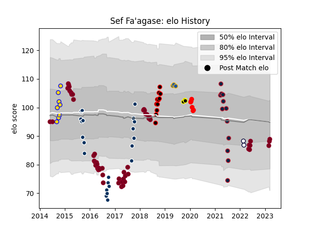

---  
layout: page  
title: Sef Fa'agase  
date: 2023-03-17 17:40:53.111896  
categories: player  
---
# Sef Fa'agase

## Positions: P

## Current elo: 89.0

## Current Percentile: None

# Elo History

# Match History

| Team                   |   Appearances |   Win Rate |
|:-----------------------|--------------:|-----------:|
| Queensland Reds        |            54 |   0.25     |
| Queensland Country     |            22 |   0.409091 |
| New England Free Jacks |            12 |   0.666667 |
| Canterbury             |            11 |   0.727273 |
| Brisbane City          |             8 |   0.75     |
| Yokohama Canon Eagles  |             6 |   0.5      |
| Highlanders            |             3 |   0.833333 |
| Wellington             |             3 |   0.666667 |
| Melbourne Rebels       |             2 |   0        |

| Opponent                 |   Matches |   Win Rate |
|:-------------------------|----------:|-----------:|
| Western Force            |         7 |   0.285714 |
| Brumbies                 |         7 |   0.285714 |
| Highlanders              |         6 |   0.333333 |
| New South Wales Waratahs |         6 |   0        |
| Melbourne Rebels         |         5 |   0.2      |
| NSW Country Eagles       |         5 |   1        |
| Hurricanes               |         4 |   0        |
| Greater Sydney Rams      |         4 |   0.5      |
| Crusaders                |         4 |   0        |
| Melbourne Rising         |         4 |   0.25     |
| Canberra Vikings         |         4 |   0.25     |
| Bulls                    |         4 |   0.375    |
| Sunwolves                |         3 |   0.666667 |
| North Harbour Rays       |         3 |   0.333333 |
| Tasman                   |         3 |   0.333333 |
| Brisbane City            |         3 |   0.333333 |
| Blues                    |         3 |   0.166667 |
| Perth Spirit             |         3 |   0.333333 |
| Stormers                 |         2 |   0        |
| NOLA Gold                |         2 |   0        |
| Auckland                 |         2 |   0        |
| Chiefs                   |         2 |   0        |
| L. A. Giltinis           |         1 |   0        |
| Manawatu                 |         1 |   1        |
| Rugby New York           |         1 |   1        |
| Saitama Wild Knights     |         1 |   0        |
| San Diego Legion         |         1 |   1        |
| Seattle Seawolves        |         1 |   1        |
| Sharks                   |         1 |   1        |
| Southern Kings           |         1 |   1        |
| Cheetahs                 |         1 |   1        |
| Sydney Rays              |         1 |   1        |
| Sydney Stars             |         1 |   0        |
| Taranaki                 |         1 |   1        |
| Canterbury               |         1 |   1        |
| Toronto Arrows           |         1 |   1        |
| Utah Warriors            |         1 |   1        |
| Wellington               |         1 |   1        |
| Rugby ATL                |         1 |   1        |
| R.U. New York            |         1 |   1        |
| Queensland Reds          |         1 |   0        |
| Houston SaberCats        |         1 |   1        |
| Kobelco Kobe Steelers    |         1 |   0        |
| Jaguares                 |         1 |   1        |
| Mie Honda Heat           |         1 |   0        |
| Mitsubishi Dynaboars     |         1 |   1        |
| Moana Pasifika           |         1 |   1        |
| Bay of Plenty            |         1 |   1        |
| Hawke's Bay              |         1 |   1        |
| Queensland Country       |         1 |   1        |
| Green Rockets Tokatsu    |         1 |   1        |
| North Harbour            |         1 |   1        |
| Fijian Drua              |         1 |   1        |
| Northland                |         1 |   1        |
| Old Glory DC             |         1 |   0        |
| Counties Manukau         |         1 |   1        |
| Munakata Sanix Blues     |         1 |   1        |