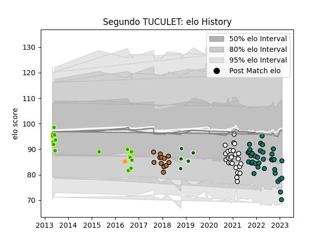

---  
layout: page  
title: Segundo TUCULET  
date: 2023-03-30 11:33:10.096386  
categories: player  
---
# Segundo TUCULET

Last updated: 2023-03-30
## Positions: FB, W

## Current elo: 68.0

## Current Percentile: 12.0

# Elo History

# Match History

| Team                       |   Appearances |   Win Rate |
|:---------------------------|--------------:|-----------:|
| Montauban                  |            30 |   0.483333 |
| Valence Romans Drome Rugby |            25 |   0.38     |
| Los Tilos                  |            17 |   0.264706 |
| I Medicei                  |            12 |   0.416667 |
| Narbonne                   |            12 |   0.166667 |
| Ealing Trailfinders        |             5 |   0.6      |
| Jaguares                   |             1 |   0        |

| Opponent                 |   Matches |   Win Rate |
|:-------------------------|----------:|-----------:|
| Mont-de-Marsan           |         6 |   0.416667 |
| Aurillac                 |         5 |   0.4      |
| Rouen                    |         5 |   0.6      |
| Vannes                   |         4 |   0.75     |
| Grenoble                 |         4 |   0        |
| Biarritz Olympique       |         4 |   0.25     |
| Provence Rugby           |         4 |   0        |
| Carcassonne              |         4 |   0.5      |
| Montauban                |         4 |   0.25     |
| Soyaux-Angouleme         |         3 |   0.166667 |
| Nevers                   |         3 |   0.666667 |
| Agen                     |         3 |   0.666667 |
| Bayonne                  |         3 |   0.333333 |
| Colomiers                |         3 |   0.333333 |
| Beziers                  |         3 |   0.5      |
| Petrarca Padova Rugby    |         2 |   0        |
| US Bressane              |         2 |   0.75     |
| Narbonne                 |         2 |   1        |
| La Plata                 |         2 |   0.25     |
| Perpignan                |         2 |   0        |
| Alumni                   |         2 |   0        |
| Rugby Colorno 1975       |         1 |   1        |
| CASI                     |         1 |   0        |
| Regatas Bella Vista      |         1 |   0        |
| Richmond                 |         1 |   1        |
| Dax                      |         1 |   0        |
| Rugby Lyons Piacenza     |         1 |   1        |
| SIC                      |         1 |   0        |
| San Albano               |         1 |   0        |
| San Cirano               |         1 |   0        |
| San Luis                 |         1 |   0        |
| Southern Kings           |         1 |   0        |
| Valorugby Emilia         |         1 |   0        |
| Rugby Viadana 1970       |         1 |   1        |
| Nottingham               |         1 |   0        |
| Oyonnax                  |         1 |   0        |
| Olivos                   |         1 |   1        |
| Femi CZ Rugby Rovigo     |         1 |   0        |
| Fiamme Oro Roma          |         1 |   0        |
| Coventry                 |         1 |   1        |
| Hindu                    |         1 |   0        |
| Kawasaki Robot Calvisano |         1 |   0        |
| Lafert San Dona          |         1 |   0        |
| Lazio Rugby              |         1 |   1        |
| Liceo Militar            |         1 |   1        |
| London Irish             |         1 |   0        |
| Manuel Belgrano          |         1 |   0        |
| Mariano Moreno           |         1 |   1        |
| Mogliano Rugby 1969      |         1 |   1        |
| Champagnat               |         1 |   1        |
| CUBA                     |         1 |   0        |
| Doncaster                |         1 |   1        |
| Massy                    |         1 |   0        |