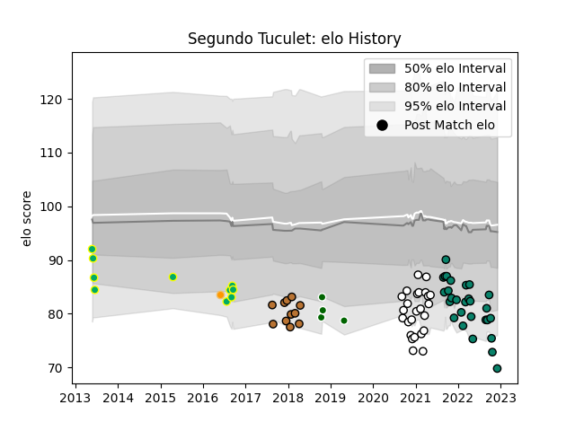

---  
layout: page  
title: Segundo Tuculet  
date: 2022-12-12 15:04:24.732910  
categories: player  
---
# Segundo Tuculet

## Positions: FB, W

## Current elo: 70.0

## Current Percentile: 3.0

# Elo History

# Match History

| Team                       |   Appearances |   Win Rate |
|:---------------------------|--------------:|-----------:|
| Montauban                  |            28 |   0.5      |
| Valence Romans Drome Rugby |            25 |   0.38     |
| Narbonne                   |            11 |   0.181818 |
| Los Tilos                  |            10 |   0.05     |
| Ealing Trailfinders        |             4 |   0.5      |
| Jaguares                   |             1 |   0        |

| Opponent            |   Matches |   Win Rate |
|:--------------------|----------:|-----------:|
| Mont-de-Marsan      |         6 |   0.416667 |
| Aurillac            |         5 |   0.4      |
| Rouen               |         5 |   0.6      |
| Montauban           |         4 |   0.25     |
| Carcassonne         |         4 |   0.5      |
| Provence Rugby      |         4 |   0        |
| Grenoble            |         4 |   0        |
| Vannes              |         4 |   0.75     |
| Agen                |         3 |   0.666667 |
| Biarritz Olympique  |         3 |   0.333333 |
| Colomiers           |         3 |   0.333333 |
| Nevers              |         3 |   0.666667 |
| Beziers             |         3 |   0.5      |
| Soyaux-Angouleme    |         3 |   0.166667 |
| Bayonne             |         2 |   0.5      |
| Narbonne            |         2 |   1        |
| Perpignan           |         2 |   0        |
| San Luis            |         1 |   0        |
| San Cirano          |         1 |   0        |
| San Albano          |         1 |   0        |
| Regatas Bella Vista |         1 |   0        |
| Southern Kings      |         1 |   0        |
| Richmond            |         1 |   1        |
| US Bressane         |         1 |   1        |
| SIC                 |         1 |   0        |
| CUBA                |         1 |   0        |
| Nottingham          |         1 |   0        |
| Alumni              |         1 |   0        |
| Massy               |         1 |   0        |
| Manuel Belgrano     |         1 |   0        |
| London Irish        |         1 |   0        |
| La Plata            |         1 |   0.5      |
| CASI                |         1 |   0        |
| Dax                 |         1 |   0        |
| Coventry            |         1 |   1        |
| Oyonnax             |         1 |   0        |