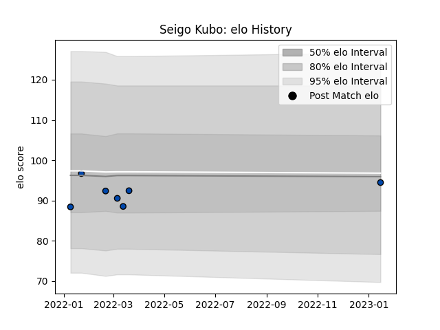

---  
layout: page  
title: Seigo Kubo  
date: 2023-01-17 11:28:48.564701  
categories: player  
---
# Seigo Kubo

## Positions: W

## Current elo: 95.0

## Current Percentile: 40.0

# Elo History

# Match History

| Team                |   Appearances |   Win Rate |
|:--------------------|--------------:|-----------:|
| Skyactivs Hiroshima |             7 |   0.142857 |

| Opponent                        |   Matches |   Win Rate |
|:--------------------------------|----------:|-----------:|
| Mie Honda Heat                  |         2 |          0 |
| Hanazono Kintetsu Liners        |         1 |          0 |
| Hino Red Dolphins               |         1 |          0 |
| Kamaishi Seawaves               |         1 |          1 |
| Mitsubishi Dynaboars            |         1 |          0 |
| NTT Docomo Red Hurricanes Osaka |         1 |          0 |