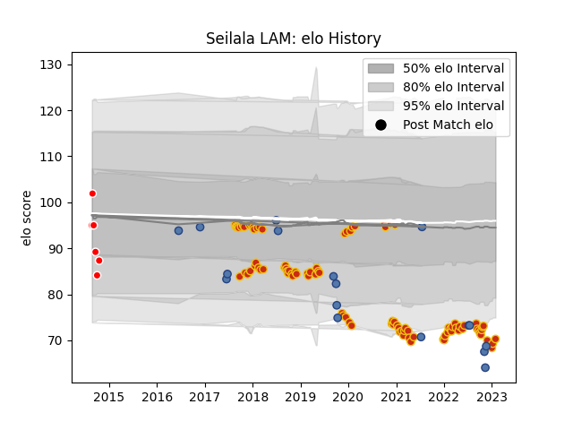

---  
layout: page  
title: Seilala LAM  
date: 2023-02-26 11:19:16.347058  
categories: player  
---
# Seilala LAM

## Positions: H

## Country: Samoa

## Current elo: 87.0

## Current Percentile: 23.0

# Elo History

# Match History

| Team             |   Appearances |   Win Rate |
|:-----------------|--------------:|-----------:|
| Perpignan        |           100 |   0.57     |
| Samoa            |            17 |   0.558824 |
| Canberra Vikings |             6 |   0.5      |

| Opponent                   |   Matches |   Win Rate |
|:---------------------------|----------:|-----------:|
| Castres Olympique          |         5 |   0.2      |
| Vannes                     |         5 |   1        |
| Grenoble                   |         5 |   0.8      |
| Biarritz Olympique         |         5 |   1        |
| Colomiers                  |         4 |   0.5      |
| Montauban                  |         4 |   0.75     |
| Oyonnax                    |         4 |   0.75     |
| Soyaux-Angouleme           |         4 |   0.875    |
| Mont-de-Marsan             |         4 |   0.5      |
| Aurillac                   |         4 |   0.875    |
| Toulon                     |         4 |   0.25     |
| Carcassonne                |         3 |   1        |
| Stade Toulousain           |         3 |   0.333333 |
| La Rochelle                |         3 |   0        |
| Bayonne                    |         3 |   0.666667 |
| Nevers                     |         3 |   0.666667 |
| Bordeaux Begles            |         3 |   0.666667 |
| Pau                        |         3 |   0        |
| Tonga                      |         3 |   1        |
| Clermont Auvergne          |         3 |   0        |
| Lyon                       |         3 |   0.333333 |
| Provence Rugby             |         2 |   1        |
| Racing 92                  |         2 |   0.5      |
| Stade Francais Paris       |         2 |   0        |
| Valence Romans Drome Rugby |         2 |   1        |
| Narbonne                   |         2 |   1        |
| Montpellier Herault        |         2 |   0        |
| Agen                       |         2 |   0        |
| Massy                      |         2 |   0.5      |
| Beziers                    |         2 |   0        |
| Brive                      |         2 |   0.5      |
| Germany                    |         2 |   1        |
| Dax                        |         2 |   1        |
| Georgia                    |         2 |   0.75     |
| Roval Drome XV             |         1 |   1        |
| Australia                  |         1 |   0        |
| Brisbane City              |         1 |   0        |
| Sydney Stars               |         1 |   0.5      |
| Canada                     |         1 |   1        |
| Dragons                    |         1 |   1        |
| Scotland                   |         1 |   0        |
| Fiji                       |         1 |   1        |
| Romania                    |         1 |   1        |
| Japan                      |         1 |   0        |
| Queensland Country         |         1 |   1        |
| Perth Spirit               |         1 |   0        |
| Gloucester Rugby           |         1 |   0        |
| North Harbour Rays         |         1 |   0.5      |
| New Zealand                |         1 |   0        |
| Greater Sydney Rams        |         1 |   1        |
| Ireland                    |         1 |   0        |
| Italy                      |         1 |   0        |
| Wales                      |         1 |   0        |