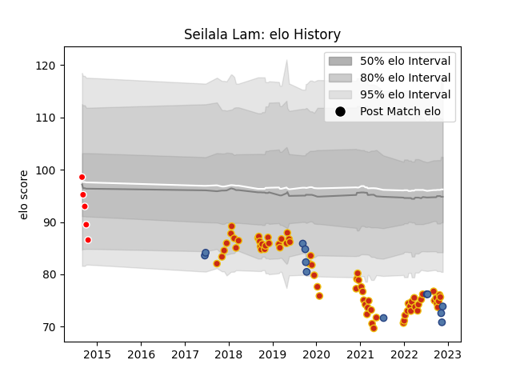

---  
layout: page  
title: Seilala Lam  
date: 2022-11-16 11:27:25.147190  
categories: player  
---
# Seilala Lam

## Positions: H

## Country: Samoa

## Current elo: 78.0

## Current Percentile: 3.0

# Elo History

# Match History

| Team             |   Appearances |   Win Rate |
|:-----------------|--------------:|-----------:|
| Perpignan        |            69 |   0.463768 |
| Samoa            |            11 |   0.363636 |
| Canberra Vikings |             3 |   0.666667 |

| Opponent                   |   Matches |   Win Rate |
|:---------------------------|----------:|-----------:|
| Castres Olympique          |         5 |   0.2      |
| Vannes                     |         4 |   1        |
| Soyaux-Angouleme           |         4 |   0.875    |
| Toulon                     |         4 |   0.25     |
| Stade Toulousain           |         3 |   0.333333 |
| Oyonnax                    |         3 |   0.666667 |
| Aurillac                   |         3 |   0.833333 |
| Lyon                       |         3 |   0.333333 |
| La Rochelle                |         3 |   0        |
| Grenoble                   |         3 |   0.666667 |
| Pau                        |         3 |   0        |
| Clermont Auvergne          |         3 |   0        |
| Tonga                      |         2 |   1        |
| Stade Francais Paris       |         2 |   0        |
| Brive                      |         2 |   0.5      |
| Bordeaux Begles            |         2 |   0.5      |
| Biarritz Olympique         |         2 |   1        |
| Valence Romans Drome Rugby |         2 |   1        |
| Bayonne                    |         2 |   0.5      |
| Racing 92                  |         2 |   0.5      |
| Montpellier Herault        |         2 |   0        |
| Nevers                     |         2 |   0.5      |
| Provence Rugby             |         2 |   1        |
| Agen                       |         2 |   0        |
| Sydney Stars               |         1 |   0.5      |
| Scotland                   |         1 |   0        |
| Roval Drome XV             |         1 |   1        |
| Mont-de-Marsan             |         1 |   0        |
| North Harbour Rays         |         1 |   0.5      |
| New Zealand                |         1 |   0        |
| Montauban                  |         1 |   0        |
| Japan                      |         1 |   0        |
| Italy                      |         1 |   0        |
| Ireland                    |         1 |   0        |
| Greater Sydney Rams        |         1 |   1        |
| Georgia                    |         1 |   1        |
| Fiji                       |         1 |   1        |
| Colomiers                  |         1 |   1        |
| Carcassonne                |         1 |   1        |
| Beziers                    |         1 |   0        |
| Australia                  |         1 |   0        |
| Wales                      |         1 |   0        |