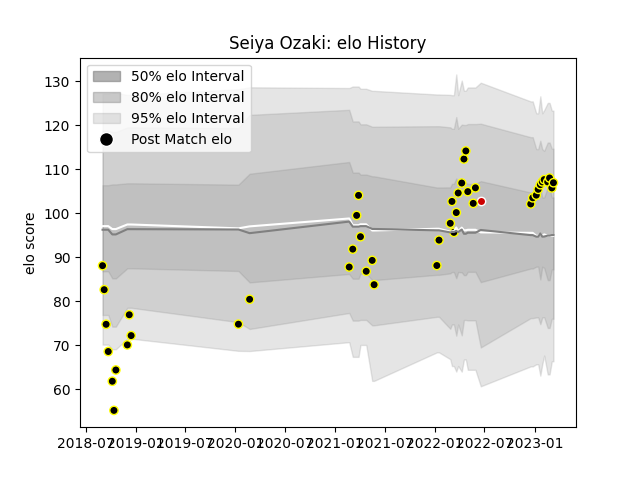

---  
layout: page  
title: Seiya Ozaki  
date: 2023-02-02 18:55:46.733082  
categories: player  
---
# Seiya Ozaki

## Positions: W, FB

## Country: Japan

## Current elo: 123.0

## Current Percentile: 90.0

# Elo History

# Match History

| Team             |   Appearances |   Win Rate |
|:-----------------|--------------:|-----------:|
| Tokyo Sungoliath |            19 |   0.789474 |
| Japan            |             1 |   1        |

| Opponent                          |   Matches |   Win Rate |
|:----------------------------------|----------:|-----------:|
| Toshiba Brave Lupus Tokyo         |         3 |   0.333333 |
| Kobelco Kobe Steelers             |         2 |   1        |
| Kubota Spears Funabashi Tokyo-Bay |         2 |   0.5      |
| Yokohama Canon Eagles             |         2 |   1        |
| Black Rams Tokyo                  |         1 |   1        |
| Green Rockets Tokatsu             |         1 |   1        |
| Hanazono Kintetsu Liners          |         1 |   1        |
| Hino Red Dolphins                 |         1 |   1        |
| Mitsubishi Dynaboars              |         1 |   1        |
| NTT Docomo Red Hurricanes Osaka   |         1 |   1        |
| Saitama Wild Knights              |         1 |   0        |
| Shizuoka Blue Revs                |         1 |   1        |
| Toyota Verblitz                   |         1 |   1        |
| Urayasu D-Rocks                   |         1 |   1        |
| Uruguay                           |         1 |   1        |