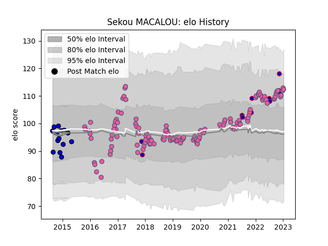

---  
layout: page  
title: Sekou MACALOU  
date: 2023-01-30 18:32:42.577901  
categories: player  
---
# Sekou MACALOU

## Positions: FL, N8

## Country: France

## Current elo: 111.0

## Current Percentile: 83.0

# Elo History

# Match History

| Team                 |   Appearances |   Win Rate |
|:---------------------|--------------:|-----------:|
| Stade Francais Paris |           131 |   0.515267 |
| Massy                |            14 |   0.285714 |
| France               |            11 |   0.772727 |

| Opponent            |   Matches |   Win Rate |
|:--------------------|----------:|-----------:|
| Stade Toulousain    |        12 |   0.416667 |
| Castres Olympique   |        11 |   0.636364 |
| Racing 92           |        11 |   0.363636 |
| Pau                 |        10 |   0.8      |
| La Rochelle         |         9 |   0.666667 |
| Toulon              |         9 |   0.333333 |
| Agen                |         8 |   0.5      |
| Bordeaux Begles     |         7 |   0.428571 |
| Montpellier Herault |         7 |   0.5      |
| Clermont Auvergne   |         7 |   0.285714 |
| Perpignan           |         7 |   0.714286 |
| Lyon                |         7 |   0.285714 |
| Brive               |         6 |   0.5      |
| Bayonne             |         5 |   0.8      |
| Edinburgh           |         4 |   0.5      |
| Japan               |         4 |   0.875    |
| Australia           |         3 |   0.666667 |
| Biarritz Olympique  |         3 |   0.333333 |
| Grenoble            |         3 |   0.333333 |
| Tarbes              |         2 |   0.5      |
| Oyonnax             |         2 |   0        |
| Munster             |         2 |   0.5      |
| Mont-de-Marsan      |         2 |   0.5      |
| Montauban           |         1 |   0        |
| Bristol Rugby       |         1 |   0        |
| London Irish        |         1 |   1        |
| New Zealand         |         1 |   0        |
| Argentina           |         1 |   1        |
| Beziers             |         1 |   1        |
| Harlequins          |         1 |   0        |
| Benetton Treviso    |         1 |   0        |
| South Africa        |         1 |   1        |
| Georgia             |         1 |   1        |
| Colomiers           |         1 |   0        |
| Timisoara Saracens  |         1 |   1        |
| Carcassonne         |         1 |   1        |
| Worcester Warriors  |         1 |   0        |
| Zebre               |         1 |   1        |