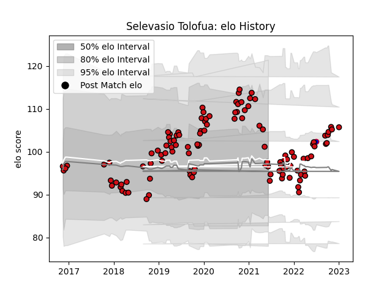

---  
layout: page  
title: Selevasio Tolofua  
date: 2023-01-06 00:08:16.733373  
categories: player  
---
# Selevasio Tolofua

## Positions: N8, FL

## Country: France

## Current elo: 103.0

## Current Percentile: 51.0

# Elo History

# Match History

| Team             |   Appearances |   Win Rate |
|:-----------------|--------------:|-----------:|
| Stade Toulousain |           114 |   0.675439 |
| France           |             1 |   1        |

| Opponent             |   Matches |   Win Rate |
|:---------------------|----------:|-----------:|
| Clermont Auvergne    |        10 |   0.75     |
| Lyon                 |        10 |   0.45     |
| Bordeaux Begles      |        10 |   0.8      |
| Racing 92            |         9 |   0.666667 |
| Montpellier Herault  |         9 |   0.666667 |
| La Rochelle          |         9 |   0.777778 |
| Toulon               |         7 |   0.5      |
| Castres Olympique    |         6 |   0.416667 |
| Stade Francais Paris |         6 |   0.416667 |
| Brive                |         5 |   1        |
| Pau                  |         5 |   0.6      |
| Bayonne              |         4 |   0.25     |
| Perpignan            |         4 |   0.75     |
| Agen                 |         3 |   1        |
| Connacht             |         2 |   1        |
| Sale Sharks          |         2 |   0.75     |
| Gloucester Rugby     |         2 |   1        |
| Bath Rugby           |         2 |   1        |
| Leinster             |         2 |   0.5      |
| Biarritz Olympique   |         2 |   1        |
| Ulster               |         1 |   1        |
| Japan                |         1 |   1        |
| Grenoble             |         1 |   1        |
| Exeter Chiefs        |         1 |   0        |
| Cardiff Blues        |         1 |   1        |
| Zebre                |         1 |   1        |