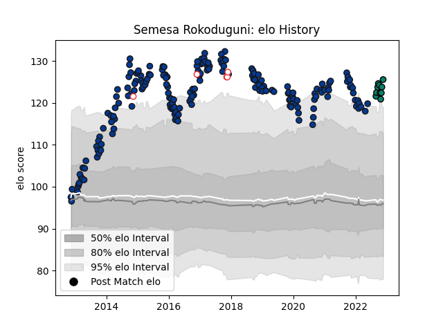

---  
layout: page  
title: Semesa Rokoduguni  
date: 2022-11-22 11:36:49.593568  
categories: player  
---
# Semesa Rokoduguni

## Positions: W

## Country: England

## Current elo: 126.0

## Current Percentile: 97.0

# Elo History

# Match History

| Team       |   Appearances |   Win Rate |
|:-----------|--------------:|-----------:|
| Bath Rugby |           188 |   0.526596 |
| Montauban  |            10 |   0.4      |
| England    |             5 |   0.8      |

| Opponent             |   Matches |   Win Rate |
|:---------------------|----------:|-----------:|
| Wasps                |        17 |   0.441176 |
| Harlequins           |        17 |   0.411765 |
| Leicester Tigers     |        16 |   0.6875   |
| Saracens             |        15 |   0.233333 |
| Northampton Saints   |        14 |   0.428571 |
| Gloucester Rugby     |        14 |   0.678571 |
| Worcester Warriors   |        13 |   0.846154 |
| Exeter Chiefs        |        13 |   0.307692 |
| Sale Sharks          |        13 |   0.5      |
| Newcastle Falcons    |        11 |   0.545455 |
| London Irish         |        10 |   1        |
| Bristol Rugby        |         7 |   0.428571 |
| Leinster             |         4 |   0.25     |
| London Welsh         |         3 |   1        |
| Stade Toulousain     |         3 |   0        |
| Brive                |         2 |   1        |
| Pau                  |         2 |   1        |
| Bordeaux Begles      |         2 |   1        |
| Toulon               |         2 |   0        |
| Scarlets             |         1 |   1        |
| Stade Francais Paris |         1 |   0        |
| Biarritz Olympique   |         1 |   0        |
| Benetton Treviso     |         1 |   1        |
| Ulster               |         1 |   0        |
| Samoa                |         1 |   1        |
| Beziers              |         1 |   0        |
| Provence Rugby       |         1 |   0        |
| Australia            |         1 |   1        |
| Ospreys              |         1 |   0        |
| Clermont Auvergne    |         1 |   0        |
| Nevers               |         1 |   1        |
| New Zealand          |         1 |   0        |
| Colomiers            |         1 |   1        |
| Montpellier Herault  |         1 |   1        |
| Mont-de-Marsan       |         1 |   1        |
| Massy                |         1 |   1        |
| Aurillac             |         1 |   0        |
| Grenoble             |         1 |   0        |
| Carcassonne          |         1 |   0        |
| Glasgow Warriors     |         1 |   0        |
| Fiji                 |         1 |   1        |
| Cardiff Blues        |         1 |   0        |
| Dragons              |         1 |   1        |
| Argentina            |         1 |   1        |