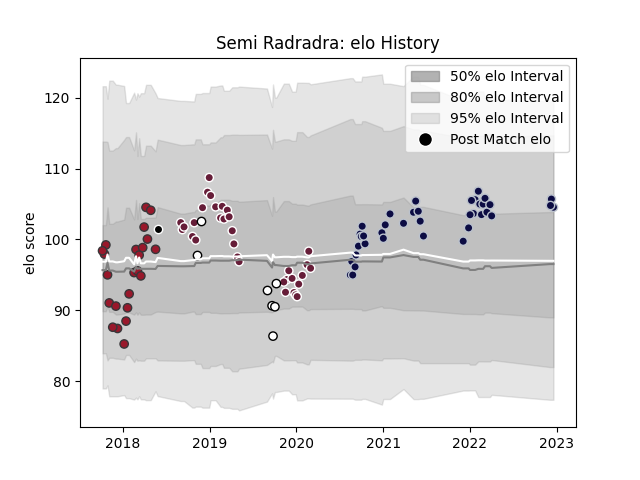

---  
layout: page  
title: Semi Radradra  
date: 2022-12-18 16:31:00.158214  
categories: player  
---
# Semi Radradra

## Positions: C, W

## Country: Fiji

## Current elo: 105.0

## Current Percentile: 78.0

# Elo History

# Match History

| Team            |   Appearances |   Win Rate |
|:----------------|--------------:|-----------:|
| Bristol Rugby   |            38 |   0.644737 |
| Bordeaux Begles |            33 |   0.621212 |
| Toulon          |            23 |   0.586957 |
| Fiji            |             7 |   0.428571 |
| Barbarians      |             1 |   1        |

| Opponent             |   Matches |   Win Rate |
|:---------------------|----------:|-----------:|
| Agen                 |         6 |   0.666667 |
| Lyon                 |         6 |   0.583333 |
| Racing 92            |         5 |   0.4      |
| Bath Rugby           |         4 |   0.75     |
| Stade Francais Paris |         4 |   0.75     |
| Castres Olympique    |         4 |   0.75     |
| Perpignan            |         4 |   0.875    |
| Leicester Tigers     |         4 |   0.625    |
| Harlequins           |         4 |   0.5      |
| Gloucester Rugby     |         3 |   0.666667 |
| Wasps                |         3 |   0.666667 |
| Scarlets             |         3 |   0.666667 |
| Montpellier Herault  |         3 |   0.5      |
| Bordeaux Begles      |         3 |   0.666667 |
| Exeter Chiefs        |         3 |   0.333333 |
| Clermont Auvergne    |         3 |   0.666667 |
| Toulon               |         2 |   0.5      |
| Saracens             |         2 |   0.5      |
| Sale Sharks          |         2 |   0.5      |
| Stade Toulousain     |         2 |   0        |
| Pau                  |         2 |   0.5      |
| Northampton Saints   |         2 |   0.5      |
| Newcastle Falcons    |         2 |   1        |
| Brive                |         2 |   0.5      |
| London Irish         |         2 |   0.5      |
| Edinburgh            |         2 |   0.75     |
| La Rochelle          |         2 |   1        |
| Benetton Treviso     |         2 |   1        |
| Worcester Warriors   |         2 |   0.5      |
| Uruguay              |         1 |   0        |
| Wales                |         1 |   0        |
| Tonga                |         1 |   1        |
| France               |         1 |   1        |
| Dragons              |         1 |   1        |
| Scotland             |         1 |   0        |
| Georgia              |         1 |   1        |
| Oyonnax              |         1 |   0        |
| Munster              |         1 |   0        |
| Bayonne              |         1 |   1        |
| Australia            |         1 |   0        |
| England              |         1 |   1        |
| Grenoble             |         1 |   1        |
| Zebre                |         1 |   1        |