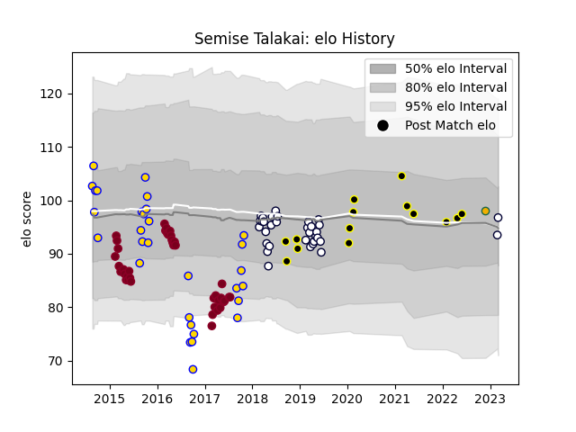

---  
layout: page  
title: Semise Talakai  
date: 2023-03-07 16:17:00.094028  
categories: player  
---
# Semise Talakai

## Positions: P

## Country: Australia

## Current elo: 96.0

## Current Percentile: 55.0

# Elo History

# Match History

| Team             |   Appearances |   Win Rate |
|:-----------------|--------------:|-----------:|
| Queensland Reds  |            40 |   0.2875   |
| Melbourne Rebels |            33 |   0.393939 |
| Brisbane City    |            30 |   0.683333 |
| Tokyo Sungoliath |            14 |   0.642857 |
| Australia        |             1 |   1        |

| Opponent                          |   Matches |   Win Rate |
|:----------------------------------|----------:|-----------:|
| New South Wales Waratahs          |         9 |   0        |
| Brumbies                          |         8 |   0.625    |
| Western Force                     |         6 |   0.333333 |
| Hurricanes                        |         5 |   0        |
| Crusaders                         |         5 |   0        |
| Highlanders                       |         5 |   0.4      |
| Sunwolves                         |         4 |   1        |
| Greater Sydney Rams               |         4 |   0.5      |
| NSW Country Eagles                |         4 |   0.625    |
| Sharks                            |         4 |   0.5      |
| Canberra Vikings                  |         4 |   0.75     |
| Melbourne Rising                  |         4 |   0.5      |
| Queensland Reds                   |         4 |   0.75     |
| Queensland Country                |         4 |   0.75     |
| Chiefs                            |         3 |   0        |
| Melbourne Rebels                  |         3 |   0.666667 |
| Blues                             |         3 |   0.5      |
| Bulls                             |         3 |   0        |
| Lions                             |         3 |   0        |
| Sydney Stars                      |         3 |   1        |
| Perth Spirit                      |         3 |   0.666667 |
| Stormers                          |         3 |   0        |
| Saitama Wild Knights              |         2 |   0        |
| Black Rams Tokyo                  |         2 |   1        |
| North Harbour Rays                |         2 |   0.5      |
| Kobelco Kobe Steelers             |         2 |   0        |
| Jaguares                          |         2 |   0        |
| Cheetahs                          |         2 |   1        |
| Kubota Spears Funabashi Tokyo-Bay |         1 |   1        |
| Hino Red Dolphins                 |         1 |   1        |
| Shizuoka Blue Revs                |         1 |   1        |
| Southern Kings                    |         1 |   1        |
| Green Rockets Tokatsu             |         1 |   1        |
| Fijian Drua                       |         1 |   1        |
| Sydney Rays                       |         1 |   1        |
| Toshiba Brave Lupus Tokyo         |         1 |   0        |
| Toyota Verblitz                   |         1 |   1        |
| Urayasu D-Rocks                   |         1 |   1        |
| Wales                             |         1 |   1        |
| Mitsubishi Dynaboars              |         1 |   1        |