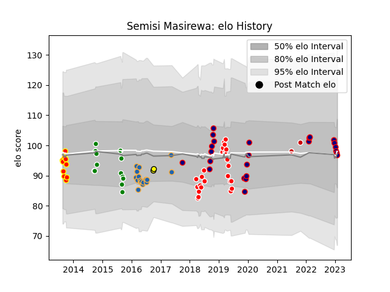

---  
layout: page  
title: Semisi Masirewa  
date: 2023-01-13 11:27:09.240021  
categories: player  
---
# Semisi Masirewa

## Positions: W, FB

## Country: Japan

## Current elo: 99.0

## Current Percentile: 64.0

# Elo History

# Match History

| Team                     |   Appearances |   Win Rate |
|:-------------------------|--------------:|-----------:|
| Sunwolves                |            24 |   0.125    |
| Hanazono Kintetsu Liners |            21 |   0.857143 |
| Western Force            |            17 |   0.176471 |
| Manawatu                 |            13 |   0.538462 |
| Waikato                  |            10 |   0.4      |
| Japan                    |             2 |   0        |
| Perth Spirit             |             2 |   1        |

| Opponent                          |   Matches |   Win Rate |
|:----------------------------------|----------:|-----------:|
| New South Wales Waratahs          |         5 |        0.2 |
| Melbourne Rebels                  |         5 |        0   |
| Southland                         |         4 |        0.5 |
| Brumbies                          |         4 |        0   |
| Queensland Reds                   |         4 |        0.5 |
| Blues                             |         3 |        0   |
| Kamaishi Seawaves                 |         3 |        1   |
| Hurricanes                        |         3 |        0   |
| Highlanders                       |         3 |        0   |
| Northland                         |         2 |        1   |
| Mazda Blue Zoomers                |         2 |        1   |
| Otago                             |         2 |        0.5 |
| Kyuden Voltex                     |         2 |        1   |
| Kurita Water Gush                 |         2 |        1   |
| Jaguares                          |         2 |        0.5 |
| Auckland                          |         2 |        0.5 |
| Crusaders                         |         2 |        0   |
| Counties Manukau                  |         2 |        0   |
| Stormers                          |         2 |        0   |
| Chiefs                            |         2 |        0   |
| Canterbury                        |         2 |        0   |
| Tasman                            |         2 |        0   |
| Bulls                             |         2 |        0.5 |
| Waikato                           |         2 |        0.5 |
| Hawke's Bay                       |         2 |        1   |
| NTT Docomo Red Hurricanes Osaka   |         1 |        1   |
| Skyactivs Hiroshima               |         1 |        1   |
| Shimizu Blue Sharks               |         1 |        1   |
| Sunwolves                         |         1 |        1   |
| Sharks                            |         1 |        0   |
| Taranaki                          |         1 |        1   |
| Toyota Industries Shuttles Aichi  |         1 |        1   |
| Kubota Spears Funabashi Tokyo-Bay |         1 |        0   |
| Munakata Sanix Blues              |         1 |        1   |
| Mitsubishi Dynaboars              |         1 |        1   |
| Lions                             |         1 |        0   |
| Australia                         |         1 |        0   |
| Kobelco Kobe Steelers             |         1 |        0   |
| Ireland                           |         1 |        0   |
| Hino Red Dolphins                 |         1 |        1   |
| Green Rockets Tokatsu             |         1 |        0   |
| Coca-Cola Red Sparks              |         1 |        1   |
| Chugoku Red Regulions             |         1 |        1   |
| Cheetahs                          |         1 |        0   |
| Canberra Vikings                  |         1 |        1   |
| Brisbane City                     |         1 |        1   |
| Bay of Plenty                     |         1 |        1   |
| Wellington                        |         1 |        0   |