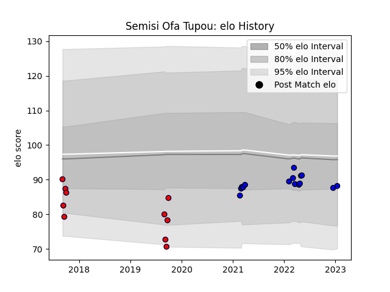

---  
layout: page  
title: Semisi Ofa Tupou  
date: 2023-01-15 11:57:43.883015  
categories: player  
---
# Semisi Ofa Tupou

## Positions: W, C

## Current elo: 88.0

## Current Percentile: 25.0

# Elo History

# Match History

| Team                 |   Appearances |   Win Rate |
|:---------------------|--------------:|-----------:|
| Saitama Wild Knights |            15 |        1   |
| Melbourne Rising     |            10 |        0.3 |

| Opponent                          |   Matches |   Win Rate |
|:----------------------------------|----------:|-----------:|
| Black Rams Tokyo                  |         2 |        1   |
| Queensland Country                |         2 |        0.5 |
| Toyota Verblitz                   |         2 |        1   |
| Sydney Rays                       |         2 |        0.5 |
| NTT Docomo Red Hurricanes Osaka   |         2 |        1   |
| Green Rockets Tokatsu             |         2 |        1   |
| Yokohama Canon Eagles             |         2 |        1   |
| Hino Red Dolphins                 |         1 |        1   |
| Kobelco Kobe Steelers             |         1 |        1   |
| Kubota Spears Funabashi Tokyo-Bay |         1 |        1   |
| NSW Country Eagles                |         1 |        0   |
| Canberra Vikings                  |         1 |        0   |
| Perth Spirit                      |         1 |        0   |
| Greater Sydney Rams               |         1 |        1   |
| Toshiba Brave Lupus Tokyo         |         1 |        1   |
| Fijian Drua                       |         1 |        0   |
| Urayasu D-Rocks                   |         1 |        1   |
| Western Force                     |         1 |        0   |