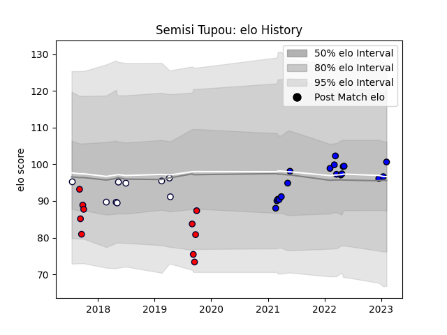

---  
layout: page  
title: Semisi Tupou  
date: 2023-02-09 13:55:21.827477  
categories: player  
---
# Semisi Tupou

## Positions: W, C

## Current elo: 101.0

## Current Percentile: 52.0

# Elo History

# Match History

| Team                 |   Appearances |   Win Rate |
|:---------------------|--------------:|-----------:|
| Saitama Wild Knights |            18 |   1        |
| Melbourne Rising     |            10 |   0.3      |
| Melbourne Rebels     |             9 |   0.444444 |

| Opponent                          |   Matches |   Win Rate |
|:----------------------------------|----------:|-----------:|
| Yokohama Canon Eagles             |         3 |        1   |
| Green Rockets Tokatsu             |         3 |        1   |
| NTT Docomo Red Hurricanes Osaka   |         2 |        1   |
| Toyota Verblitz                   |         2 |        1   |
| Sydney Rays                       |         2 |        0.5 |
| Stormers                          |         2 |        0   |
| Queensland Country                |         2 |        0.5 |
| Brumbies                          |         2 |        1   |
| Black Rams Tokyo                  |         2 |        1   |
| Kobelco Kobe Steelers             |         1 |        1   |
| Sunwolves                         |         1 |        1   |
| Western Force                     |         1 |        0   |
| Urayasu D-Rocks                   |         1 |        1   |
| Canberra Vikings                  |         1 |        0   |
| Toshiba Brave Lupus Tokyo         |         1 |        1   |
| Tokyo Sungoliath                  |         1 |        1   |
| Crusaders                         |         1 |        0   |
| Fijian Drua                       |         1 |        0   |
| Kubota Spears Funabashi Tokyo-Bay |         1 |        1   |
| Queensland Reds                   |         1 |        1   |
| Greater Sydney Rams               |         1 |        1   |
| Perth Spirit                      |         1 |        0   |
| Hino Red Dolphins                 |         1 |        1   |
| Jaguares                          |         1 |        0   |
| NSW Country Eagles                |         1 |        0   |
| New South Wales Waratahs          |         1 |        0   |