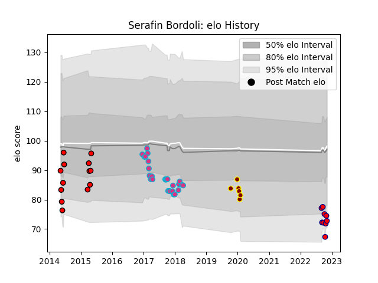

---  
layout: page  
title: Serafin Bordoli  
date: 2023-03-21 18:37:35.441156  
categories: player  
---
# Serafin Bordoli

Last updated: 2023-03-21
## Positions: FH, C

## Current elo: 73.0

## Current Percentile: 7.0

# Elo History

# Match History

| Team                       |   Appearances |   Win Rate |
|:---------------------------|--------------:|-----------:|
| Zebre                      |            30 |   0.166667 |
| Olivos                     |            13 |   0.115385 |
| Cognac Saint Jean d'Angély |             9 |   0        |
| Ampthill                   |             6 |   0.5      |

| Opponent                   |   Matches |   Win Rate |
|:---------------------------|----------:|-----------:|
| Connacht                   |         4 |   0.5      |
| Ulster                     |         3 |   0.333333 |
| Munster                    |         2 |   0        |
| Benetton Treviso           |         2 |   0        |
| Leinster                   |         2 |   0        |
| Cardiff Blues              |         2 |   0        |
| Gloucester Rugby           |         2 |   0        |
| Scarlets                   |         2 |   0        |
| Cheetahs                   |         2 |   0        |
| Glasgow Warriors           |         2 |   0        |
| San Luis                   |         2 |   0.25     |
| Regatas Bella Vista        |         1 |   0        |
| Newcastle Falcons          |         1 |   0        |
| Nottingham                 |         1 |   0        |
| Ospreys                    |         1 |   0        |
| Pueyrredón                 |         1 |   0        |
| Agen                       |         1 |   0        |
| Rennes                     |         1 |   0        |
| San Albano                 |         1 |   0        |
| Narbonne                   |         1 |   0        |
| Southern Kings             |         1 |   1        |
| Stade Toulousain           |         1 |   0        |
| Tarbes                     |         1 |   0        |
| US Bressane                |         1 |   0        |
| Valence Romans Drome Rugby |         1 |   0        |
| San Martin                 |         1 |   0        |
| Liceo Naval                |         1 |   0        |
| Mariano Moreno             |         1 |   0        |
| Chambery                   |         1 |   0        |
| Atlético del Rosario       |         1 |   0        |
| Bedford                    |         1 |   1        |
| Belgrano                   |         1 |   0        |
| Blagnac                    |         1 |   0        |
| CUBA                       |         1 |   0        |
| Carqueiranne-Hyères        |         1 |   0        |
| Coventry                   |         1 |   1        |
| Manuel Belgrano            |         1 |   1        |
| Dax                        |         1 |   0        |
| Doncaster                  |         1 |   1        |
| Dragons                    |         1 |   1        |
| Ealing Trailfinders        |         1 |   0        |
| Edinburgh                  |         1 |   0        |
| Alumni                     |         1 |   0        |
| Wasps                      |         1 |   0        |