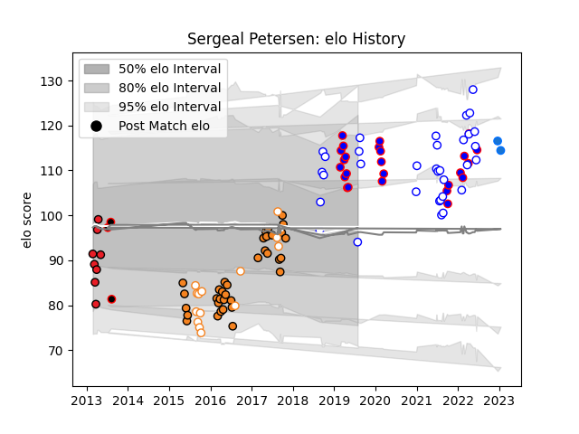

---  
layout: page  
title: Sergeal Petersen  
date: 2023-01-17 11:34:34.426016  
categories: player  
---
# Sergeal Petersen

## Positions: W, FB

## Current elo: 94.0

## Current Percentile: 75.0

# Elo History

# Match History

| Team                   |   Appearances |   Win Rate |
|:-----------------------|--------------:|-----------:|
| Cheetahs               |            35 |   0.314286 |
| Western Province       |            33 |   0.515152 |
| Stormers               |            25 |   0.58     |
| Free State Cheetahs    |            14 |   0.571429 |
| Southern Kings         |             8 |   0.3125   |
| Eastern Province Kings |             3 |   1        |
| Shimizu Blue Sharks    |             2 |   0        |

| Opponent                         |   Matches |   Win Rate |
|:---------------------------------|----------:|-----------:|
| Griquas                          |        10 |   0.4      |
| Bulls                            |         8 |   0.75     |
| Golden Lions                     |         8 |   0.375    |
| Pumas                            |         7 |   0.785714 |
| Free State Cheetahs              |         7 |   0.428571 |
| Blue Bulls                       |         6 |   0.5      |
| Natal Sharks                     |         6 |   0.75     |
| Stormers                         |         5 |   0.2      |
| Lions                            |         5 |   0.6      |
| Sharks                           |         4 |   0.25     |
| Hurricanes                       |         4 |   0.25     |
| Jaguares                         |         4 |   0.5      |
| Melbourne Rebels                 |         3 |   0.666667 |
| Sunwolves                        |         3 |   1        |
| New South Wales Waratahs         |         3 |   0        |
| Brumbies                         |         3 |   0.166667 |
| Blues                            |         3 |   0        |
| Ospreys                          |         2 |   1        |
| Munster                          |         2 |   0        |
| Zebre                            |         2 |   1        |
| Highlanders                      |         2 |   0        |
| Crusaders                        |         2 |   0        |
| Chiefs                           |         2 |   0        |
| Western Force                    |         2 |   1        |
| Queensland Reds                  |         2 |   0        |
| Southern Kings                   |         1 |   1        |
| Toyota Industries Shuttles Aichi |         1 |   0        |
| Ulster                           |         1 |   0        |
| Valke                            |         1 |   1        |
| Western Province                 |         1 |   1        |
| Benetton Treviso                 |         1 |   0        |
| Leinster                         |         1 |   1        |
| Griffons                         |         1 |   1        |
| Glasgow Warriors                 |         1 |   0        |
| Edinburgh                        |         1 |   0.5      |
| Eastern Province Kings           |         1 |   0        |
| Connacht                         |         1 |   0        |
| Border Bulldogs                  |         1 |   1        |
| Boland Cavaliers                 |         1 |   1        |
| Kamaishi Seawaves                |         1 |   0        |