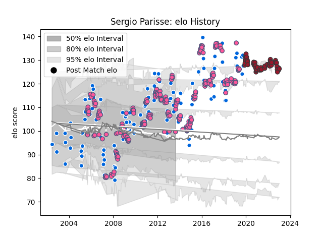

---  
layout: page  
title: Sergio Parisse  
date: 2022-12-18 16:27:01.351836  
categories: player  
---
# Sergio Parisse

## Positions: N8

## Country: Italy

## Current elo: 113.0

## Current Percentile: 85.0

# Elo History

# Match History

| Team                 |   Appearances |   Win Rate |
|:---------------------|--------------:|-----------:|
| Stade Francais Paris |           229 |   0.626638 |
| Italy                |           124 |   0.205645 |
| Toulon               |            50 |   0.67     |

| Opponent                 |   Matches |   Win Rate |
|:-------------------------|----------:|-----------:|
| Clermont Auvergne        |        24 |  0.583333  |
| Stade Toulousain         |        21 |  0.357143  |
| Montpellier Herault      |        19 |  0.552632  |
| Brive                    |        18 |  0.722222  |
| France                   |        16 |  0.125     |
| Scotland                 |        16 |  0.3125    |
| Perpignan                |        15 |  0.633333  |
| England                  |        15 |  0         |
| Ireland                  |        15 |  0.0666667 |
| Toulon                   |        14 |  0.607143  |
| Castres Olympique        |        13 |  0.884615  |
| Wales                    |        13 |  0.115385  |
| Bordeaux Begles          |        13 |  0.538462  |
| Biarritz Olympique       |        12 |  0.666667  |
| Racing 92                |        12 |  0.583333  |
| Bayonne                  |        11 |  0.454545  |
| Australia                |        10 |  0         |
| Argentina                |        10 |  0.2       |
| La Rochelle              |         9 |  0.555556  |
| Pau                      |         9 |  0.722222  |
| South Africa             |         8 |  0.125     |
| Lyon                     |         8 |  0.25      |
| Grenoble                 |         7 |  0.714286  |
| Agen                     |         7 |  0.857143  |
| Bourgoin-Jallieu         |         7 |  1         |
| Oyonnax                  |         5 |  0.4       |
| Fiji                     |         5 |  0.8       |
| New Zealand              |         5 |  0         |
| Scarlets                 |         4 |  0.75      |
| Harlequins               |         4 |  0         |
| Leicester Tigers         |         4 |  0.5       |
| Bath Rugby               |         4 |  1         |
| Stade Francais Paris     |         4 |  0.5       |
| Edinburgh                |         3 |  1         |
| Albi                     |         3 |  1         |
| Mont-de-Marsan           |         3 |  1         |
| Montauban                |         3 |  1         |
| Samoa                    |         2 |  0.5       |
| Russia                   |         2 |  1         |
| Benetton Treviso         |         2 |  1         |
| Tonga                    |         2 |  1         |
| Ospreys                  |         2 |  1         |
| Narbonne                 |         2 |  1         |
| Worcester Warriors       |         2 |  1         |
| London Irish             |         2 |  1         |
| Ulster                   |         2 |  1         |
| Munster                  |         2 |  0.5       |
| United States of America |         1 |  1         |
| Yorkshire Carnegie       |         1 |  1         |
| Leinster                 |         1 |  0         |
| Pacific Islands          |         1 |  0         |
| Namibia                  |         1 |  1         |
| Gloucester Rugby         |         1 |  1         |
| Georgia                  |         1 |  1         |
| Exeter Chiefs            |         1 |  1         |
| Dax                      |         1 |  1         |
| Cavalieri Prato          |         1 |  1         |
| Canada                   |         1 |  1         |
| Bristol Rugby            |         1 |  0         |
| Auch                     |         1 |  0         |
| Zebre                    |         1 |  1         |