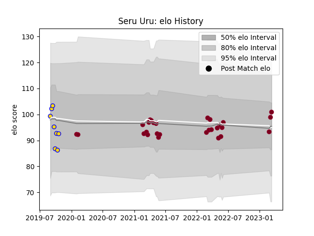

---  
layout: page  
title: Seru Uru  
date: 2023-03-21 18:47:06.538353  
categories: player  
---
# Seru Uru

Last updated: 2023-03-21
## Positions: N8, FL

## Current elo: 98.0

## Current Percentile: 64.0

# Elo History

# Match History

| Team            |   Appearances |   Win Rate |
|:----------------|--------------:|-----------:|
| Queensland Reds |            29 |   0.551724 |
| Brisbane City   |             8 |   0.4375   |

| Opponent                 |   Matches |   Win Rate |
|:-------------------------|----------:|-----------:|
| Western Force            |         6 |   0.5      |
| Brumbies                 |         6 |   0.5      |
| New South Wales Waratahs |         4 |   1        |
| Crusaders                |         3 |   0        |
| Fijian Drua              |         3 |   0.833333 |
| Chiefs                   |         2 |   0.5      |
| Highlanders              |         2 |   0        |
| Melbourne Rebels         |         2 |   1        |
| NSW Country Eagles       |         1 |   1        |
| Sydney Rays              |         1 |   1        |
| Queensland Country       |         1 |   0        |
| Blues                    |         1 |   0        |
| Moana Pasifika           |         1 |   1        |
| Melbourne Rising         |         1 |   1        |
| Hurricanes               |         1 |   0        |
| Canberra Vikings         |         1 |   0        |
| Lions                    |         1 |   0        |