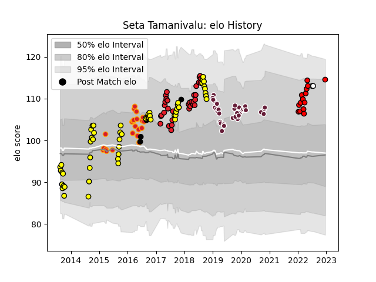

---  
layout: page  
title: Seta Tamanivalu  
date: 2023-02-04 18:28:07.968778  
categories: player  
---
# Seta Tamanivalu

## Positions: C, W

## Country: Fiji

## Current elo: 96.0

## Current Percentile: 55.0

# Elo History

# Match History

| Team                      |   Appearances |   Win Rate |
|:--------------------------|--------------:|-----------:|
| Taranaki                  |            58 |   0.568966 |
| Bordeaux Begles           |            37 |   0.594595 |
| Crusaders                 |            33 |   0.878788 |
| Toshiba Brave Lupus Tokyo |            27 |   0.555556 |
| Chiefs                    |            22 |   0.681818 |
| New Zealand               |             4 |   1        |
| Fiji                      |             2 |   0.5      |

| Opponent                          |   Matches |   Win Rate |
|:----------------------------------|----------:|-----------:|
| Tasman                            |         8 |   0.375    |
| Highlanders                       |         8 |   0.5      |
| Hurricanes                        |         7 |   0.571429 |
| Auckland                          |         7 |   0.571429 |
| Canterbury                        |         7 |   0.285714 |
| Bay of Plenty                     |         6 |   0.833333 |
| Waikato                           |         6 |   0.583333 |
| Manawatu                          |         5 |   0.8      |
| Counties Manukau                  |         5 |   0.7      |
| Agen                              |         5 |   1        |
| Wellington                        |         5 |   0.4      |
| Brumbies                          |         4 |   1        |
| Tokyo Sungoliath                  |         4 |   0.25     |
| Chiefs                            |         4 |   1        |
| Toyota Verblitz                   |         4 |   0.5      |
| Blues                             |         4 |   1        |
| Lions                             |         4 |   0.75     |
| Shizuoka Blue Revs                |         3 |   1        |
| Sharks                            |         3 |   0.666667 |
| Racing 92                         |         3 |   0.666667 |
| Kubota Spears Funabashi Tokyo-Bay |         3 |   0        |
| Southland                         |         3 |   1        |
| Melbourne Rebels                  |         3 |   1        |
| Castres Olympique                 |         3 |   0.666667 |
| Clermont Auvergne                 |         3 |   0.666667 |
| Crusaders                         |         3 |   1        |
| Hawke's Bay                       |         2 |   0.5      |
| Stade Toulousain                  |         2 |   0        |
| Stormers                          |         2 |   1        |
| Cheetahs                          |         2 |   1        |
| Sunwolves                         |         2 |   1        |
| Saitama Wild Knights              |         2 |   0        |
| Queensland Reds                   |         2 |   1        |
| Perpignan                         |         2 |   1        |
| Pau                               |         2 |   0        |
| Brive                             |         2 |   0.5      |
| Northland                         |         2 |   1        |
| New South Wales Waratahs          |         2 |   0.5      |
| NTT Docomo Red Hurricanes Osaka   |         2 |   1        |
| Montpellier Herault               |         2 |   0.25     |
| Mitsubishi Dynaboars              |         2 |   0.5      |
| Toulon                            |         2 |   0.5      |
| Lyon                              |         2 |   0.5      |
| Black Rams Tokyo                  |         2 |   0.5      |
| La Rochelle                       |         2 |   0        |
| Wales                             |         2 |   1        |
| Wasps                             |         2 |   1        |
| Stade Francais Paris              |         2 |   1        |
| Tonga                             |         1 |   1        |
| British and Irish Lions           |         1 |   0        |
| Bulls                             |         1 |   1        |
| Australia                         |         1 |   1        |
| Western Force                     |         1 |   1        |
| Connacht                          |         1 |   0        |
| Southern Kings                    |         1 |   1        |
| Samoa                             |         1 |   0        |
| Hanazono Kintetsu Liners          |         1 |   1        |
| Otago                             |         1 |   0        |
| North Harbour                     |         1 |   0        |
| Mie Honda Heat                    |         1 |   1        |
| Edinburgh                         |         1 |   0.5      |
| France                            |         1 |   1        |
| Green Rockets Tokatsu             |         1 |   1        |
| Kobelco Kobe Steelers             |         1 |   1        |
| Jaguares                          |         1 |   1        |
| Grenoble                          |         1 |   1        |
| Yokohama Canon Eagles             |         1 |   1        |