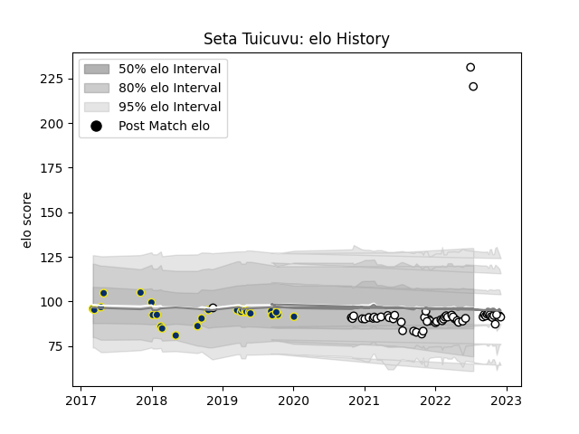

---  
layout: page  
title: Seta Tuicuvu  
date: 2023-03-29 11:31:23.827305  
categories: player  
---
# Seta Tuicuvu

Last updated: 2023-03-29
## Positions: FB, C

## Country: Fiji

## Current elo: 220.0

## Current Percentile: 35.0

# Elo History

# Match History

| Team              |   Appearances |   Win Rate |
|:------------------|--------------:|-----------:|
| Brive             |            47 |   0.223404 |
| Clermont Auvergne |            28 |   0.446429 |
| Fiji              |            10 |   0.25     |

| Opponent             |   Matches |   Win Rate |
|:---------------------|----------:|-----------:|
| Montpellier Herault  |         9 |  0.166667  |
| Stade Toulousain     |         6 |  0.166667  |
| Castres Olympique    |         6 |  0.166667  |
| Pau                  |         6 |  0.5       |
| Racing 92            |         6 |  0.0833333 |
| Stade Francais Paris |         5 |  0.4       |
| Lyon                 |         5 |  0.2       |
| Bordeaux Begles      |         5 |  0.2       |
| Clermont Auvergne    |         4 |  0.25      |
| Toulon               |         4 |  0.25      |
| Perpignan            |         3 |  0.666667  |
| New Zealand          |         2 |  0         |
| Bayonne              |         2 |  0.5       |
| Scotland             |         2 |  0         |
| Biarritz Olympique   |         2 |  0.5       |
| Agen                 |         2 |  1         |
| Wales                |         1 |  0         |
| Tonga                |         1 |  1         |
| Timisoara Saracens   |         1 |  1         |
| Saracens             |         1 |  0         |
| Spain                |         1 |  1         |
| Northampton Saints   |         1 |  1         |
| Samoa                |         1 |  0         |
| Oyonnax              |         1 |  0         |
| La Rochelle          |         1 |  0         |
| Ireland              |         1 |  0         |
| Harlequins           |         1 |  1         |
| Grenoble             |         1 |  1         |
| Georgia              |         1 |  0.5       |
| Connacht             |         1 |  0         |
| Brive                |         1 |  0         |
| Zebre                |         1 |  0         |