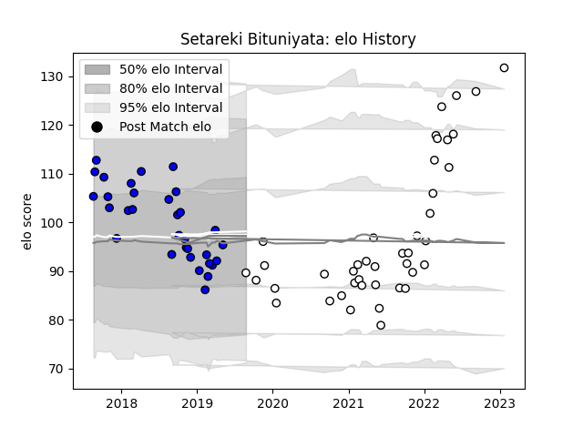

---  
layout: page  
title: Setareki Bituniyata  
date: 2023-01-23 15:29:40.881210  
categories: player  
---
# Setareki Bituniyata

## Positions: W

## Current elo: 90.0

## Current Percentile: 47.0

# Elo History

# Match History

| Team   |   Appearances |   Win Rate |
|:-------|--------------:|-----------:|
| Brive  |            42 |   0.488095 |
| Massy  |            32 |   0.28125  |

| Opponent             |   Matches |   Win Rate |
|:---------------------|----------:|-----------:|
| Pau                  |         5 |   0.6      |
| Stade Francais Paris |         5 |   0.8      |
| La Rochelle          |         5 |   0.2      |
| Vannes               |         3 |   0.333333 |
| Carcassonne          |         3 |   0.666667 |
| Perpignan            |         3 |   0.333333 |
| Toulon               |         3 |   0.666667 |
| Stade Toulousain     |         3 |   0        |
| Bayonne              |         3 |   0.333333 |
| Biarritz Olympique   |         3 |   0.666667 |
| Brive                |         2 |   0.5      |
| US Bressane          |         2 |   0        |
| Provence Rugby       |         2 |   0.5      |
| Beziers              |         2 |   0        |
| Nevers               |         2 |   0.5      |
| Narbonne             |         2 |   0.5      |
| Montpellier Herault  |         2 |   0.75     |
| Montauban            |         2 |   0        |
| Aurillac             |         2 |   0        |
| Lyon                 |         2 |   0        |
| Bordeaux Begles      |         2 |   0.5      |
| Soyaux-Angouleme     |         2 |   0.5      |
| Bristol Rugby        |         2 |   0        |
| Clermont Auvergne    |         2 |   0.5      |
| Castres Olympique    |         2 |   0.5      |
| Racing 92            |         2 |   0.5      |
| Agen                 |         1 |   1        |
| Oyonnax              |         1 |   0        |
| Grenoble             |         1 |   0        |
| Colomiers            |         1 |   0        |
| Cardiff Blues        |         1 |   1        |
| Mont-de-Marsan       |         1 |   0        |