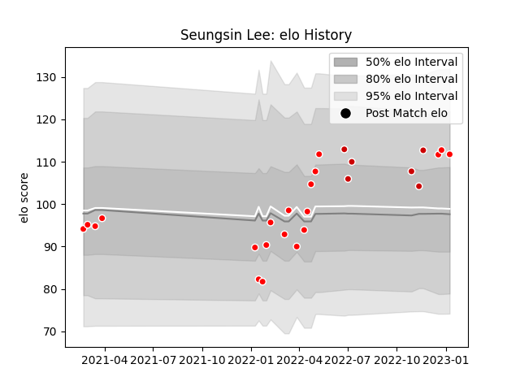

---  
layout: page  
title: Seungsin Lee  
date: 2022-11-22 11:29:11.869636  
categories: player  
---
# Seungsin Lee

## Positions: FH, C

## Country: Japan

## Current elo: 100.0

## Current Percentile: 55.0

# Elo History

# Match History

| Team                  |   Appearances |   Win Rate |
|:----------------------|--------------:|-----------:|
| Kobelco Kobe Steelers |            11 |   0.454545 |
| Japan                 |             6 |   0.166667 |

| Opponent                          |   Matches |   Win Rate |
|:----------------------------------|----------:|-----------:|
| France                            |         3 |        0   |
| Green Rockets Tokatsu             |         2 |        1   |
| Saitama Wild Knights              |         2 |        0   |
| Urayasu D-Rocks                   |         2 |        0.5 |
| Yokohama Canon Eagles             |         2 |        0.5 |
| Black Rams Tokyo                  |         1 |        1   |
| England                           |         1 |        0   |
| Kubota Spears Funabashi Tokyo-Bay |         1 |        0   |
| New Zealand                       |         1 |        0   |
| Toshiba Brave Lupus Tokyo         |         1 |        0   |
| Uruguay                           |         1 |        1   |