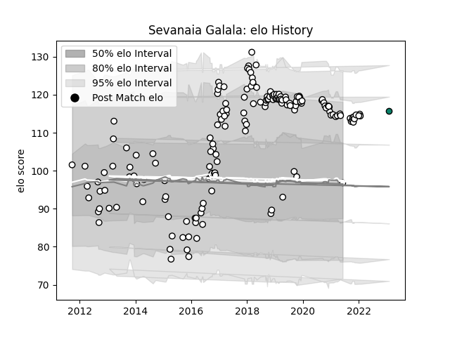

---  
layout: page  
title: Sevanaia Galala  
date: 2023-02-04 17:28:41.883615  
categories: player  
---
# Sevanaia Galala

## Positions: C, W

## Country: Fiji

## Current elo: 97.0

## Current Percentile: 85.0

# Elo History

# Match History

| Team      |   Appearances |   Win Rate |
|:----------|--------------:|-----------:|
| Brive     |           161 |   0.503106 |
| Fiji      |             3 |   0.333333 |
| Montauban |             1 |   1        |

| Opponent               |   Matches |   Win Rate |
|:-----------------------|----------:|-----------:|
| Toulon                 |        10 |   0.5      |
| Pau                    |         8 |   0.5      |
| Stade Toulousain       |         8 |   0.3125   |
| Bordeaux Begles        |         8 |   0.4375   |
| La Rochelle            |         8 |   0.375    |
| Stade Francais Paris   |         7 |   0.428571 |
| Racing 92              |         7 |   0.428571 |
| Clermont Auvergne      |         7 |   0.285714 |
| Biarritz Olympique     |         6 |   0.25     |
| Lyon                   |         6 |   0.583333 |
| Bayonne                |         5 |   0.5      |
| Grenoble               |         5 |   0.8      |
| Castres Olympique      |         5 |   0        |
| Oyonnax                |         5 |   0.6      |
| Montpellier Herault    |         5 |   0.6      |
| Agen                   |         5 |   0.8      |
| Colomiers              |         4 |   0.75     |
| Vannes                 |         3 |   1        |
| Newcastle Falcons      |         3 |   0.666667 |
| Aurillac               |         3 |   0.333333 |
| Zebre                  |         3 |   0.333333 |
| Carcassonne            |         3 |   0.333333 |
| Beziers                |         3 |   0.666667 |
| Provence Rugby         |         2 |   0.5      |
| Nevers                 |         2 |   1        |
| Calvisano              |         2 |   0.75     |
| RC Enisei              |         2 |   1        |
| Connacht               |         2 |   0        |
| Bucuresti              |         2 |   1        |
| New Zealand Maori      |         2 |   0.5      |
| US Bressane            |         2 |   0.5      |
| Montauban              |         2 |   0.5      |
| Mont-de-Marsan         |         2 |   0.5      |
| Bath Rugby             |         2 |   0        |
| Worcester Warriors     |         2 |   1        |
| Soyaux-Angouleme       |         2 |   1        |
| Tonga                  |         1 |   0        |
| Tarbes                 |         1 |   1        |
| Bristol Rugby          |         1 |   0        |
| Gloucester Rugby       |         1 |   0        |
| Scarlets               |         1 |   1        |
| Leicester Tigers       |         1 |   0        |
| Dax                    |         1 |   1        |
| Narbonne               |         1 |   1        |
| Dragons                |         1 |   0        |
| Edinburgh              |         1 |   0        |
| Enisey-STM Krasnoyarsk |         1 |   1        |
| Massy                  |         1 |   1        |