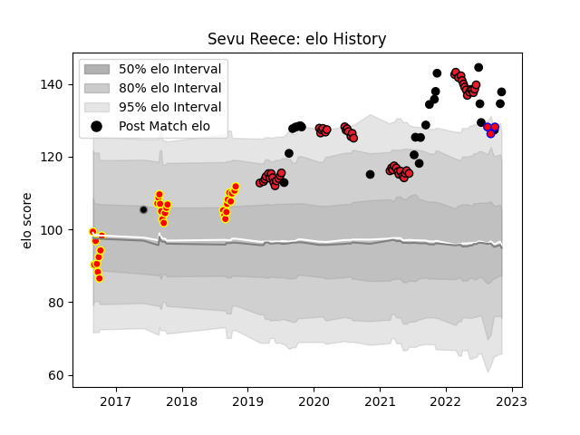

---  
layout: page  
title: Sevu Reece  
date: 2023-03-16 20:10:10.331044  
categories: player  
---
# Sevu Reece

## Positions: W

## Country: New Zealand

## Current elo: 137.0

## Current Percentile: 98.0

# Elo History

# Match History

| Team                |   Appearances |   Win Rate |
|:--------------------|--------------:|-----------:|
| Crusaders           |            58 |   0.810345 |
| Waikato             |            30 |   0.516667 |
| New Zealand         |            23 |   0.73913  |
| Tasman              |             3 |   0        |
| Provincial Union XV |             1 |   0        |

| Opponent                 |   Matches |   Win Rate |
|:-------------------------|----------:|-----------:|
| Chiefs                   |        12 |   0.583333 |
| Highlanders              |        10 |   0.9      |
| Hurricanes               |         8 |   0.875    |
| Blues                    |         7 |   0.857143 |
| Australia                |         5 |   0.8      |
| Ireland                  |         5 |   0.4      |
| Northland                |         4 |   0.5      |
| North Harbour            |         4 |   0.25     |
| Wellington               |         4 |   0.5      |
| Queensland Reds          |         4 |   1        |
| Auckland                 |         3 |   0.666667 |
| New South Wales Waratahs |         3 |   0.666667 |
| Melbourne Rebels         |         3 |   1        |
| Hawke's Bay              |         3 |   0.666667 |
| Brumbies                 |         3 |   1        |
| Taranaki                 |         3 |   0.5      |
| Manawatu                 |         3 |   0.333333 |
| South Africa             |         2 |   0.5      |
| Wales                    |         2 |   1        |
| Argentina                |         2 |   1        |
| Bay of Plenty            |         2 |   0.5      |
| Fijian Drua              |         2 |   0.5      |
| Fiji                     |         2 |   1        |
| Counties Manukau         |         2 |   0.5      |
| Canterbury               |         2 |   0        |
| Jaguares                 |         1 |   1        |
| Southland                |         1 |   1        |
| Tonga                    |         1 |   1        |
| Tasman                   |         1 |   0        |
| British and Irish Lions  |         1 |   0        |
| Sunwolves                |         1 |   1        |
| Stormers                 |         1 |   0.5      |
| Sharks                   |         1 |   0.5      |
| Bulls                    |         1 |   1        |
| Lions                    |         1 |   1        |
| Otago                    |         1 |   1        |
| England                  |         1 |   0        |
| Namibia                  |         1 |   1        |
| Italy                    |         1 |   1        |
| Japan                    |         1 |   1        |