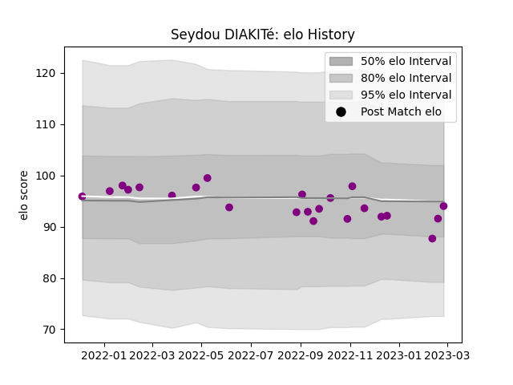

---  
layout: page  
title: Seydou DIAKITé  
date: 2023-02-24 02:26:46.537174  
categories: player  
---
# Seydou DIAKITé

## Positions: P

## Current elo: 91.0

## Current Percentile: 44.0

# Elo History

# Match History

| Team             |   Appearances |   Win Rate |
|:-----------------|--------------:|-----------:|
| Soyaux-Angouleme |            22 |        0.5 |

| Opponent                   |   Matches |   Win Rate |
|:---------------------------|----------:|-----------:|
| Massy                      |         3 |   0.666667 |
| Agen                       |         1 |   1        |
| Albi                       |         1 |   1        |
| Valence Romans Drome Rugby |         1 |   0        |
| Tarbes                     |         1 |   1        |
| Provence Rugby             |         1 |   0        |
| Nice                       |         1 |   0        |
| Nevers                     |         1 |   0        |
| Montauban                  |         1 |   0        |
| Mont-de-Marsan             |         1 |   0        |
| Grenoble                   |         1 |   0        |
| Dijon                      |         1 |   1        |
| Colomiers                  |         1 |   0        |
| Carcassonne                |         1 |   1        |
| Bourgoin-Jallieu           |         1 |   1        |
| Biarritz Olympique         |         1 |   0        |
| Beziers                    |         1 |   1        |
| Aurillac                   |         1 |   0        |
| Aubenas                    |         1 |   1        |
| Vannes                     |         1 |   1        |