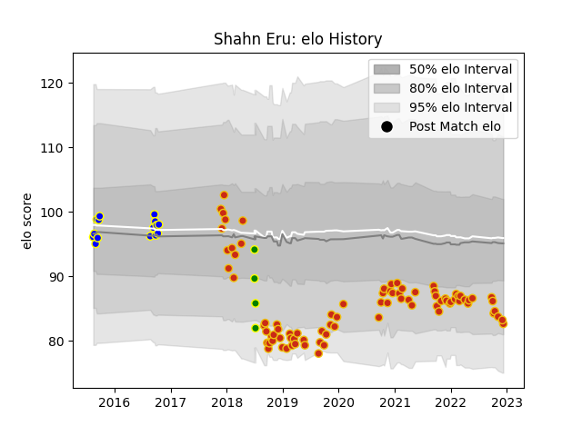

---  
layout: page  
title: Shahn Eru  
date: 2022-12-14 11:22:57.461119  
categories: player  
---
# Shahn Eru

## Positions: L, FL

## Country: Cook Islands

## Current elo: 83.0

## Current Percentile: 13.0

# Elo History

# Match History

| Team          |   Appearances |   Win Rate |
|:--------------|--------------:|-----------:|
| Perpignan     |            85 |   0.458824 |
| Bay of Plenty |            15 |   0.4      |
| Cook Islands  |             4 |   0        |

| Opponent                   |   Matches |   Win Rate |
|:---------------------------|----------:|-----------:|
| Toulon                     |         5 |   0.4      |
| Castres Olympique          |         5 |   0.2      |
| Montauban                  |         4 |   0.75     |
| Vannes                     |         4 |   1        |
| Hong Kong                  |         4 |   0        |
| Stade Toulousain           |         4 |   0.25     |
| Carcassonne                |         4 |   0.75     |
| Clermont Auvergne          |         4 |   0.25     |
| Montpellier Herault        |         4 |   0.25     |
| Racing 92                  |         3 |   0.333333 |
| Lyon                       |         3 |   0        |
| La Rochelle                |         3 |   0.333333 |
| Pau                        |         3 |   0        |
| Mont-de-Marsan             |         3 |   0.666667 |
| Bordeaux Begles            |         3 |   0.166667 |
| Biarritz Olympique         |         3 |   0.666667 |
| Beziers                    |         3 |   0.333333 |
| Stade Francais Paris       |         3 |   0        |
| Rouen                      |         2 |   0.5      |
| Soyaux-Angouleme           |         2 |   1        |
| Taranaki                   |         2 |   0        |
| Oyonnax                    |         2 |   0.5      |
| Northland                  |         2 |   1        |
| North Harbour              |         2 |   0.5      |
| Nevers                     |         2 |   1        |
| Agen                       |         2 |   0        |
| Aurillac                   |         2 |   0.75     |
| Hawke's Bay                |         2 |   0.5      |
| Grenoble                   |         2 |   0.5      |
| Narbonne                   |         1 |   1        |
| Colomiers                  |         1 |   1        |
| Waikato                    |         1 |   0        |
| Valence Romans Drome Rugby |         1 |   1        |
| Bayonne                    |         1 |   1        |
| Tasman                     |         1 |   0        |
| Bristol Rugby              |         1 |   0        |
| Brive                      |         1 |   1        |
| Connacht                   |         1 |   0        |
| Auckland                   |         1 |   0        |
| Southland                  |         1 |   0        |
| Counties Manukau           |         1 |   1        |
| Dax                        |         1 |   1        |
| Provence Rugby             |         1 |   0        |
| Manawatu                   |         1 |   1        |
| Massy                      |         1 |   1        |
| Wellington                 |         1 |   0        |