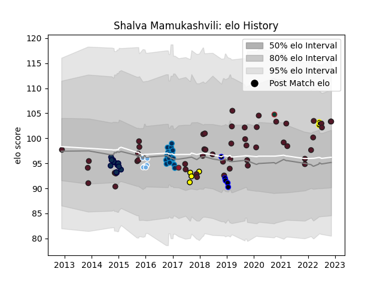

---  
layout: page  
title: Shalva Mamukashvili  
date: 2023-02-05 15:12:27.858581  
categories: player  
---
# Shalva Mamukashvili

## Positions: H

## Country: Georgia

## Current elo: 103.0

## Current Percentile: 22.0

# Elo History

# Match History

| Team                   |   Appearances |   Win Rate |
|:-----------------------|--------------:|-----------:|
| Georgia                |            73 |   0.643836 |
| Montpellier Herault    |            17 |   0.529412 |
| Black Lion             |            16 |   0.8125   |
| Sale Sharks            |            13 |   0.307692 |
| Carcassonne            |             8 |   0.375    |
| Glasgow Warriors       |             7 |   0.571429 |
| RC Enisei              |             5 |   0        |
| Enisey-STM Krasnoyarsk |             1 |   0        |
| Leicester Tigers       |             1 |   0        |
| Toulon                 |             1 |   0.5      |

| Opponent                 |   Matches |   Win Rate |
|:-------------------------|----------:|-----------:|
| Spain                    |         8 |   0.875    |
| Romania                  |         5 |   1        |
| Russia                   |         5 |   1        |
| Portugal                 |         5 |   1        |
| Tonga                    |         4 |   0.75     |
| Germany                  |         4 |   1        |
| Samoa                    |         4 |   0.625    |
| Japan                    |         4 |   0.25     |
| Castres Olympique        |         4 |   0.5      |
| Tel-Aviv Heat            |         4 |   0.75     |
| Canada                   |         4 |   0.5      |
| Bristol Rugby            |         4 |   0        |
| United States of America |         4 |   0.5      |
| Northampton Saints       |         4 |   0.25     |
| Scotland                 |         3 |   0        |
| Saracens                 |         3 |   0        |
| Fiji                     |         3 |   0.5      |
| Wales                    |         3 |   0.333333 |
| Belgium                  |         3 |   1        |
| Italy                    |         3 |   0.333333 |
| Argentina                |         3 |   0        |
| Racing 92                |         2 |   0.5      |
| Scarlets                 |         2 |   1        |
| Romanian Wolves          |         2 |   1        |
| Netherlands              |         2 |   1        |
| Toulon                   |         2 |   0.5      |
| Wasps                    |         2 |   0.5      |
| Newcastle Falcons        |         2 |   0.5      |
| Massy                    |         2 |   0        |
| Zebre                    |         2 |   0        |
| La Rochelle              |         2 |   0.5      |
| Castilla y Leon Iberians |         2 |   1        |
| Leinster                 |         2 |   0.5      |
| Grenoble                 |         2 |   0.75     |
| Edinburgh                |         1 |   0        |
| SWD Eagles               |         1 |   1        |
| France                   |         1 |   0        |
| Exeter Chiefs            |         1 |   1        |
| Enisey-STM Krasnoyarsk   |         1 |   1        |
| Stade Francais Paris     |         1 |   0        |
| Dax                      |         1 |   1        |
| Clermont Auvergne        |         1 |   0        |
| Bordeaux Begles          |         1 |   1        |
| Boland Cavaliers         |         1 |   0        |
| Uruguay                  |         1 |   1        |
| Biarritz Olympique       |         1 |   1        |
| Benetton Treviso         |         1 |   1        |
| Gloucester Rugby         |         1 |   0        |
| Lokomotiv Penza          |         1 |   1        |
| Griffons                 |         1 |   0        |
| Narbonne                 |         1 |   0        |
| Lusitanos XV             |         1 |   1        |
| Lyon                     |         1 |   1        |
| Australia                |         1 |   0        |
| Montauban                |         1 |   0        |
| Munster                  |         1 |   0        |
| Namibia                  |         1 |   1        |
| Leopards                 |         1 |   1        |
| London Welsh             |         1 |   1        |
| Nevers                   |         1 |   1        |
| New Zealand              |         1 |   0        |
| Leicester Tigers         |         1 |   0        |
| Pau                      |         1 |   0        |
| Perpignan                |         1 |   0        |
| RC Batumi                |         1 |   1        |
| Ireland                  |         1 |   0        |