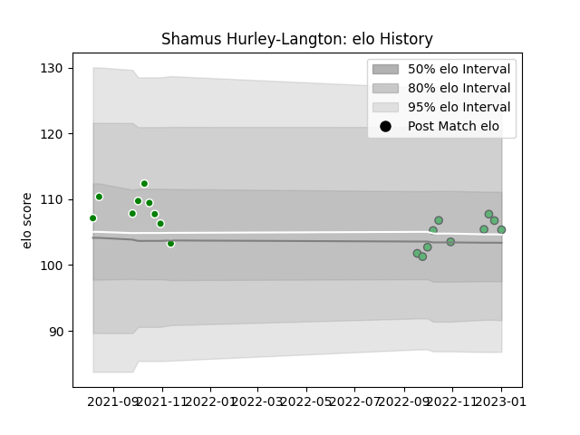

---  
layout: page  
title: Shamus Hurley-Langton  
date: 2022-12-14 11:25:28.336003  
categories: player  
---
# Shamus Hurley-Langton

## Positions: FL

## Current elo: 96.0

## Current Percentile: 44.0

# Elo History

# Match History

| Team     |   Appearances |   Win Rate |
|:---------|--------------:|-----------:|
| Manawatu |             9 |   0.444444 |
| Connacht |             7 |   0.428571 |

| Opponent          |   Matches |   Win Rate |
|:------------------|----------:|-----------:|
| Otago             |         2 |        0.5 |
| Bulls             |         1 |        0   |
| Canterbury        |         1 |        0   |
| Counties Manukau  |         1 |        1   |
| Hawke's Bay       |         1 |        0   |
| Leinster          |         1 |        0   |
| Munster           |         1 |        1   |
| Newcastle Falcons |         1 |        1   |
| Northland         |         1 |        1   |
| Ospreys           |         1 |        1   |
| Southland         |         1 |        1   |
| Stormers          |         1 |        0   |
| Taranaki          |         1 |        0   |
| Ulster            |         1 |        0   |
| Wellington        |         1 |        0   |