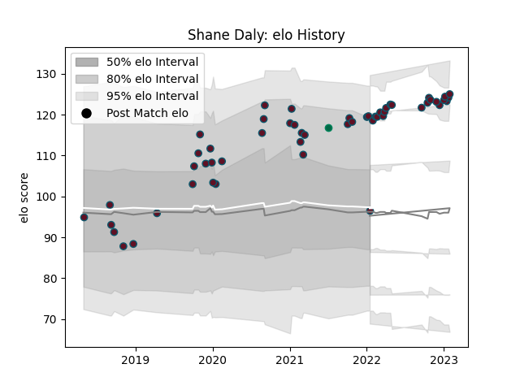

---  
layout: page  
title: Shane Daly  
date: 2022-12-18 16:38:52.657053  
categories: player  
---
# Shane Daly

## Positions: W, FB

## Country: Ireland

## Current elo: 122.0

## Current Percentile: 97.0

# Elo History

# Match History

| Team    |   Appearances |   Win Rate |
|:--------|--------------:|-----------:|
| Munster |            47 |    0.56383 |
| Ireland |             1 |    1       |

| Opponent         |   Matches |   Win Rate |
|:-----------------|----------:|-----------:|
| Ulster           |         7 |   0.357143 |
| Leinster         |         6 |   0        |
| Connacht         |         6 |   0.833333 |
| Cardiff Blues    |         5 |   0.6      |
| Edinburgh        |         3 |   0.666667 |
| Ospreys          |         2 |   0.5      |
| Southern Kings   |         2 |   1        |
| Scarlets         |         2 |   1        |
| Benetton Treviso |         2 |   1        |
| Glasgow Warriors |         2 |   0        |
| Dragons          |         2 |   1        |
| Cheetahs         |         2 |   1        |
| Bulls            |         1 |   1        |
| Lions            |         1 |   0        |
| Japan            |         1 |   1        |
| Racing 92        |         1 |   0        |
| Stade Toulousain |         1 |   0        |
| Stormers         |         1 |   1        |
| Zebre            |         1 |   1        |