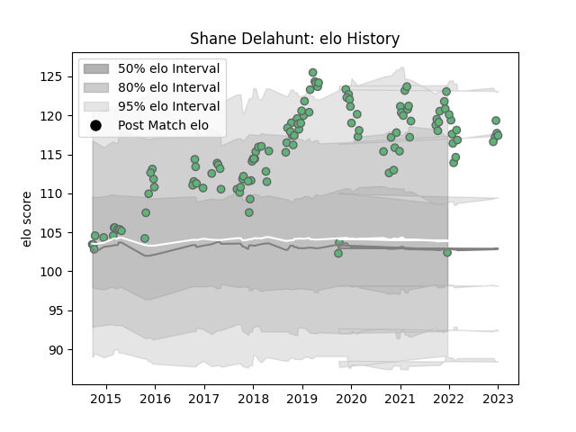

---  
layout: page  
title: Shane Delahunt  
date: 2023-02-02 19:13:01.263047  
categories: player  
---
# Shane Delahunt

## Positions: H

## Current elo: 92.0

## Current Percentile: 99.0

# Elo History

# Match History

| Team     |   Appearances |   Win Rate |
|:---------|--------------:|-----------:|
| Connacht |           123 |   0.495935 |

| Opponent             |   Matches |   Win Rate |
|:---------------------|----------:|-----------:|
| Ulster               |        13 |   0.384615 |
| Munster              |        12 |   0.166667 |
| Leinster             |        10 |   0.3      |
| Cardiff Blues        |         9 |   0.388889 |
| Ospreys              |         7 |   0.571429 |
| Benetton Treviso     |         7 |   1        |
| Glasgow Warriors     |         7 |   0        |
| Zebre                |         6 |   0.833333 |
| Scarlets             |         6 |   0.166667 |
| Edinburgh            |         6 |   0.333333 |
| Dragons              |         5 |   0.6      |
| Newcastle Falcons    |         4 |   0.5      |
| Brive                |         3 |   1        |
| Southern Kings       |         3 |   1        |
| Sale Sharks          |         2 |   0.5      |
| Worcester Warriors   |         2 |   0.75     |
| Bordeaux Begles      |         2 |   1        |
| Stade Toulousain     |         2 |   0.5      |
| Stade Francais Paris |         2 |   0.5      |
| Leicester Tigers     |         2 |   0        |
| Oyonnax              |         2 |   1        |
| Cheetahs             |         2 |   0.5      |
| Gloucester Rugby     |         2 |   0.5      |
| RC Enisei            |         1 |   1        |
| Lions                |         1 |   1        |
| Sharks               |         1 |   1        |
| Perpignan            |         1 |   1        |
| Bulls                |         1 |   1        |
| Stormers             |         1 |   1        |
| Bayonne              |         1 |   1        |